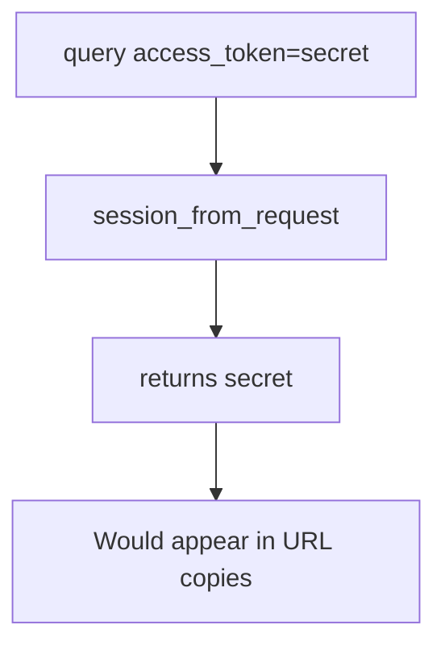

# 4.3-LO-03 — Observe the query token accepted, do not trophy a log

**Kind:** mechanism-lab
**Loop step:** 3 Break
**Standards:** OWASP ASVS 5.0.0 (final) `v5.0.0-14.2.1`. TLS encrypts the hop, not the access log.

## Authorized scope

`labs/4.3/4.3-lab` only. The fixture is an in-process `session_from_request`. Synthetic token `secret`. It does not open uvicorn, a CDN, or a browser history. Do not harvest Referer from a live site, dump production access logs, or replay a real session cookie.

**Forbidden outcome:** session established from a query-string token. `session_from_request({"access_token": "secret"}, {}, None)` returns `"secret"`.

Attacker capability in this lab: a log operator, a Referer collector, or a shared screenshot who can read the URL. Trust assumption: the parser is supposed to ignore query tokens. FastAPI query binding, Next.js address bar, and “we use JWTs” are not in the TCB for this cell.

## Mental model: query wins



The vulnerable tree demonstrates **cause** (token in a logged channel), not a trophy dump of production logs. Preconditions: `session_from_request` prefers `query.get("access_token")`. You do not need a live GET. You must not fetch a URL that contains a real token.

ASVS `v5.0.0-14.2.1` wants secrets in body or headers, not the URL. HTTPS is a hop mechanism, not that sentence.

## What to read in the fixture

`vulnerable/token.py` returns `query.get("access_token")` first. Tests:

- `test_query_string_token_is_rejected` — query-only yields `None`
- `test_cookie_session_still_works` — `sc_session` still works on the fixed tree
- `test_authorization_header_still_works`

You do not need a new token string. The failure of `test_query_string_token_is_rejected` *is* the evidence.

Do not open the fixed tree yet. Diagnose the cause first.

## Root cause vs impact vs prevention vs detection vs recovery

| Slice | This lab |
|---|---|
| Required property | Query `access_token` does not mint a session |
| Root cause | Token placed in a logged, shared channel |
| Preconditions | `session_from_request` prefers query |
| Trigger | `session_from_request({"access_token": "secret"}, {}, None)` |
| Impact | Confidentiality of the session artifact; then 1.2 as whoever holds the URL |
| Prevention | Ignore query tokens; Cookie or Authorization only |
| Detection | `query_token_rejected`; log-redact gateway |
| Recovery | Revoke the leaked token; purge logs (3.1) |
| Not the lesson | A JWT algorithm name, NextAuth, or “HTTPS so logs are fine” |

## Framework defaults versus the channel guarantee

FastAPI will bind query params. Next.js router will put them in the address bar. TLS encrypts the hop, not the log. The application guarantee is: **this** fixture, query-only → `None`.

## Practice

```text
python3 -m pytest labs/4.3/4.3-lab/tests --impl vulnerable
```

Record `test_query_string_token_is_rejected`. Do not weaken it to “we use HTTPS.” An environment error is not security evidence.

## Transfer

Clinic deep link with `?token=`. Predict without leaving this directory. Do not click a live appointment SMS.

## Non-goals

No live-target Referer harvesting. Synthetic `secret` only.
