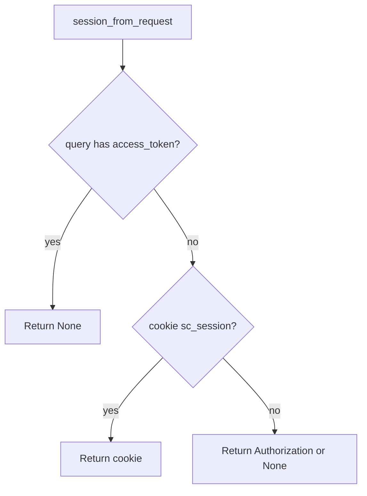

# Ignore query tokens; keep cookie and header

**Kind:** design-exercise
**Loop step:** 4 Build

## The rule

If `query` contains `access_token`, return `None` even if the value looks like a JWT. Then read cookie or Authorization. Structural means the parser **drops** the query channel — not a denylist of parameter names after logging, not a referrer policy as the only control, not “we use HTTPS.”

Session parsing needs this: presence of a query token is enough to refuse — do not “fall through” to using it. Cookie `sc_session` (HttpOnly) and `Authorization` remain valid channels.

## Picture: deny query, then other channels



The lab’s repaired files return `None` whenever the query has `access_token`. A magic-link email is still a URL token — short-lived, one-use, then exchange for a cookie; do not keep the URL as the standing session.

Secrets have to stay out of the URL — `access_token`, not a full list of log redaction.

## What the repaired files must show

| After the fix | Must be true |
|---|---|
| Query only | `None` |
| Cookie only | session value |
| Header only | session value |

## What this is not

localStorage JWT. Implicit grant. Magic-link standing session. TLS as the log control. HttpOnly as “not in the URL.” A referrer policy as the parser.

## What can still go wrong

- A magic-link email is still a URL token — later you exchange it for a cookie.
- Referer on first-party navigations — strip it on the way out.
- Header tokens leaking through a CORS misconfig (later).
- uvicorn still logging other query fields (leftover from the logging lesson).
- Screenshots you cannot purge.

## Practice

Name the channel (query) and the check (yields `None`). Run:

```text
python3 -m pytest labs/4.3/4.3-lab/tests --impl fixed
```

## Use it somewhere new

Magic-link: a one-time token in the URL is later work, then exchange for a cookie — do not keep the URL as the session. Clinic appointment SMS: same exchange, or deny.

## What this page is not doing

Do not dump live access logs. Do not claim a course gate from a Referrer-Policy header.
