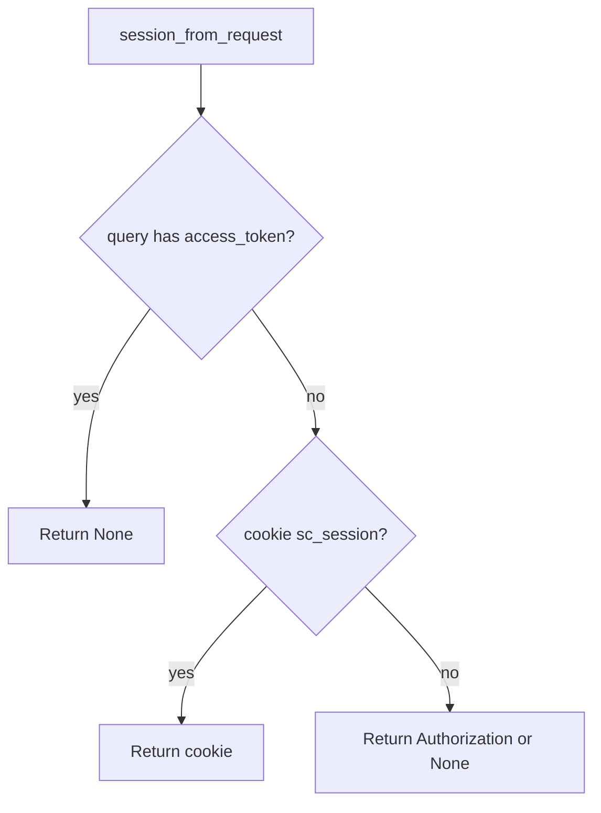

# 4.3-LO-04 — Ignore query tokens; keep cookie and header

**Kind:** design-exercise
**Loop step:** 4 Build
**Standards:** OWASP ASVS 5.0.0 (final) `v5.0.0-14.2.1` and `v5.0.0-3.3.4`.

## Structural means query cannot mint a session

If `query` contains `access_token`, return `None` even if the value looks like a JWT. Then read cookie or Authorization. Structural means the parser **drops** the query channel — not a denylist of parameter names after logging, not Referrer-Policy as the only control.

## Mental model: deny query, then other channels



Fail-safe: presence of a query token is enough to refuse — do not “fall through” to using it.

## Why this restores the cell

| After the fix | Must be true |
|---|---|
| Query only | `None` |
| Cookie only | session value |
| Header only | session value |

## What this is not

localStorage JWT. Implicit grant. Magic-link standing session. TLS as the log control.

## Practice

Name channel and predicate. Run:

```
python3 -m pytest labs/4.3/4.3-lab/tests --impl fixed
```

Must pass.

## Transfer

Magic-link: one-time token in URL is 6.6, then exchange for a cookie — do not keep the URL as the session.

## Residual risk

Referer on outbound links; uvicorn still logging other query fields.
