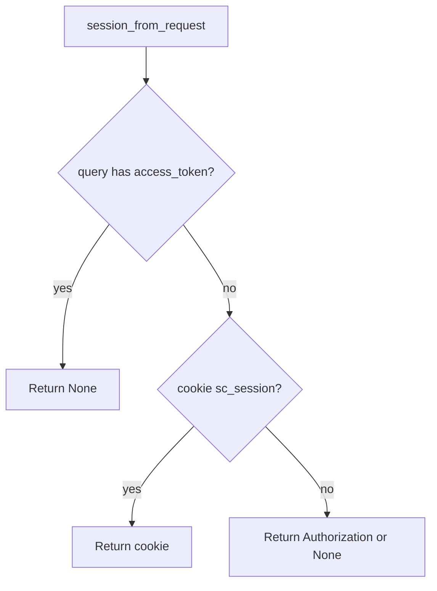

# 4.3-LO-04 — Ignore query tokens; keep cookie and header

**Kind:** design-exercise
**Loop step:** 4 Build
**Standards:** OWASP ASVS 5.0.0 (final) `v5.0.0-14.2.1` and `v5.0.0-3.3.4`. Referrer-Policy (`v5.0.0-3.4.5`) is a sister cell, not this pytest.

## Structural means query cannot mint a session

If `query` contains `access_token`, return `None` even if the value looks like a JWT. Then read cookie or Authorization. Structural means the parser **drops** the query channel — not a denylist of parameter names after logging, not Referrer-Policy as the only control, not “we use HTTPS.”

The smallest restore for SecureCollab Phase 1 session parsing is: presence of a query token is enough to refuse — do not “fall through” to using it. Cookie `sc_session` (HttpOnly, 2.3) and `Authorization` remain valid channels.

## Mental model: deny query, then other channels



The lab’s fixed tree returns `None` whenever the query has `access_token`. Magic-link email is still a URL token — time-bound, one-use (6.6), then exchange for a cookie; do not keep the URL as the standing session.

ASVS `v5.0.0-14.2.1` (Level 2) wants secrets out of the URL. This pytest is that sentence for `access_token`, not a full log-redaction catalogue (3.1).

## Why this restores the cell

| After the fix | Must be true |
|---|---|
| Query only | `None` |
| Cookie only | session value |
| Header only | session value |

## What this is not

localStorage JWT. Implicit grant. Magic-link standing session. TLS as the log control. HttpOnly as “not in the URL.” Referrer-Policy as the parser.

## Mechanism limits

- Magic-link email is still a URL token — 6.6, then cookie.
- Referer on first-party navigations — strip on outbound (`v5.0.0-3.4.5`).
- Header tokens in CORS misconfig (E2).
- uvicorn still logging other query fields (3.1 residual).

## Practice

Name channel (query) and predicate (yields `None`). Run:

```text
python3 -m pytest labs/4.3/4.3-lab/tests --impl fixed
```

Must pass.

## Transfer

Magic-link: one-time token in URL is 6.6, then exchange for a cookie — do not keep the URL as the session. Clinic appointment SMS: same exchange, or deny.

## Residual risk

Referer on outbound links; uvicorn still logging other query fields; screenshots you cannot purge.

## Non-goals

Do not dump live access logs. Do not claim Gate 4 from a Referrer-Policy header.
