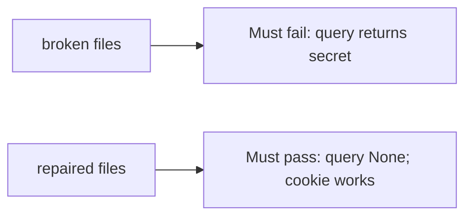

# A query that returns a secret must fail

**Kind:** verification-lab
**Loop step:** 5 Verify

## Check it

“We set Referrer-Policy” is not evidence that the parser ignores query tokens. “HTTPS” is a hop observation. The check is: `session_from_request({"access_token": "secret"}, {}, None)` is `None`. That observation must be **false** on the broken files (returns `secret`) and **true** on the repaired files.

## Picture: query returns secret must fail

A passing collection count is not this rule. The failing observation on the broken files is **query returns secret**.



| Mode | Must show for this topic |
|---|---|
| Normal | After the fix, cookie `sc_session` still works |
| Wrong input / abuse | query `access_token` → `None`; broken files must fail |
| Header | Authorization still works |
| Not claimed | Production Referer; magic-link exchange; HttpOnly on the wire |

The checks live in `labs/4.3/4.3-lab/tests/test_property.py`. `test_query_string_token_is_rejected` is there so a query-minted session cannot sneak through.

```text
python3 -m pytest labs/4.3/4.3-lab/tests --impl vulnerable
python3 -m pytest labs/4.3/4.3-lab/tests --impl fixed
```

Map each test to a row on the channel map you drew. If the broken files do not fail the query assertion, the lab is miswired — fix the wiring, not the check. Cookie and header honest-path tests may pass on both implementations; that does not excuse the query deny.

## What the tests do not prove

- HttpOnly flag on the wire
- Log redaction of other fields
- Clinic deep links (transfer)
- CORS header-token leakage (later)

Record those as leftover or later topics, not as silent passes.

## Practice

Run both this session. Write the fail/pass pair next to the matrix row. Reject a “test” that only greps `Referrer-Policy` without calling `session_from_request` on a query dict.

## Use it somewhere new

Clinic deep link. A test that only asserts HTTP 200 is not channel evidence. A test that clicks a live SMS is out of scope.

## What this page is not doing

Do not add a live GET. Do not log `secret`. Answer keys are not on this site.
