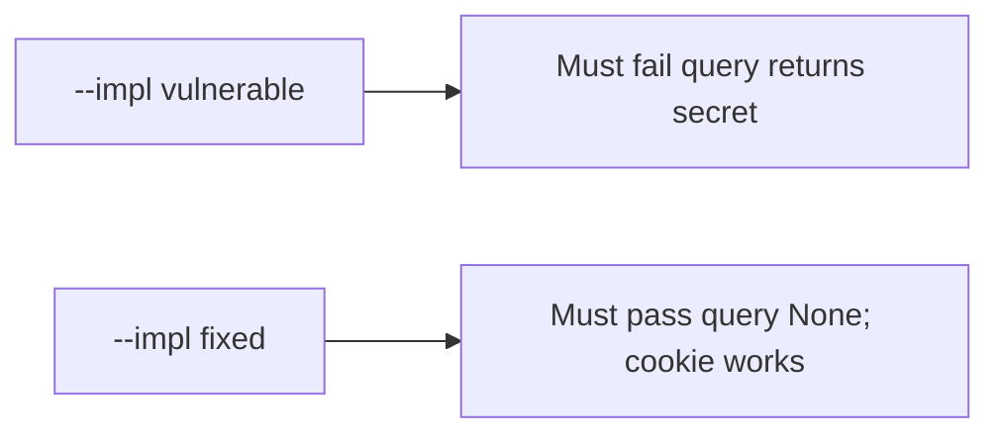

# 4.3-LO-05 — Evidence is query yields None, then a passing pair

**Kind:** verification-lab
**Loop step:** 5 Verify
**Standards:** OWASP ASVS 5.0.0 (final) `v5.0.0-14.2.1`.

## An invariant that cannot fail a test is still a slogan

“We set Referrer-Policy” is not evidence that the parser ignores query tokens. The oracle is the local pair.

## Mental model: vulnerable must fail: query returns secret

The failing observation on `--impl vulnerable` is **query returns secret**. A passing collection count is not this cell.



| Case | Must show |
|---|---|
| Negative / abuse | query `access_token` → `None` |
| Normal | cookie `sc_session` still works |
| Header | Authorization still works |
| Not claimed | Production Referer; magic-link (6.6) |

Lab tests in `labs/4.3/4.3-lab/tests/test_property.py`:

```
python3 -m pytest labs/4.3/4.3-lab/tests --impl vulnerable
python3 -m pytest labs/4.3/4.3-lab/tests --impl fixed
```

## What the tests do not prove

- HttpOnly flag on the wire (2.3)
- Log redaction of other fields (3.1)
- Clinic deep links (transfer)

## Practice

Execute both implementations. Map each test to an LO-02 cell.

## Transfer

Clinic deep link. A test that only asserts HTTP 200 is not channel evidence (see 9.3).
