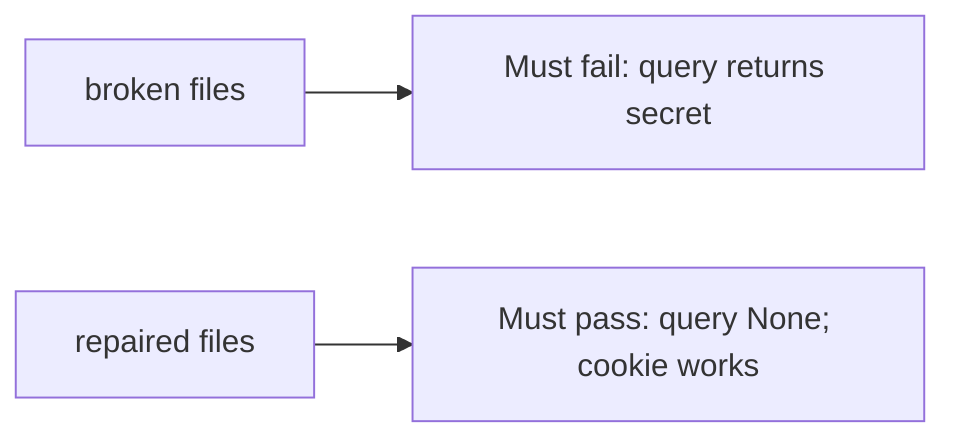

# A query that returns a secret must fail

**Kind:** verification-lab
**Loop step:** 5 Verify

## Check it

A Referrer-Policy header does not prove the parser ignores query tokens. HTTPS is a hop. `session_from_request({"access_token": "secret"}, {}, None)` has to be `None`. On the broken helper, it returns `secret`. Repair ignores a token in the query string.

## Picture: query returns secret must fail

How many tests passed is the wrong scoreboard. The failing observation on the broken files is **query returns secret**.



| Mode | Must show for this topic |
|---|---|
| Normal | After the fix, cookie `sc_session` still works |
| Wrong input / abuse | query `access_token` → `None`; broken files must fail |
| Header | Authorization still works |
| Not claimed | Production Referer; magic-link exchange; HttpOnly on the wire |

Checks live at `labs/4.3/4.3-lab/tests/test_property.py`. A query-minted session is what `test_query_string_token_is_rejected` rejects.

```text
python3 -m pytest labs/4.3/4.3-lab/tests --impl vulnerable
python3 -m pytest labs/4.3/4.3-lab/tests --impl fixed
```

Map each test to a row on the channel map you drew. If the broken files do not fail the query assertion, the lab is miswired — fix the wiring, not the check. Cookie and header honest-path tests can still look fine. Deny a token in the query.

## What the tests do not prove

- HttpOnly flag on the wire
- Log redaction of other fields
- Clinic deep links (transfer)
- CORS header-token leakage (later)

## Practice

Call `session_from_request` on a query dict. A `Referrer-Policy` header is the referrer, not the query token.

## Use it somewhere new

HTTP 200 on a deep link is not channel evidence. Do not run a test that clicks a live SMS.

## What this page is not doing

Do not add a live GET. Do not log `secret`. Answer keys are not on this site.
