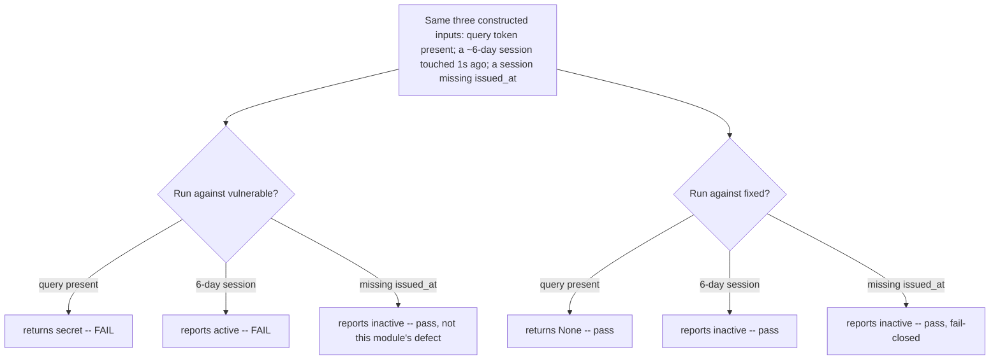

# A query that returns a secret, and a stale session that reports itself active, must both fail

**Kind:** verification-lab
**Loop step:** 5 Verify
**Standards:** OWASP ASVS 5.0.0 `v5.0.0-7.3.1` (an inactivity timeout enforced per documented risk decisions) and `v5.0.0-7.3.2` (an absolute maximum session lifetime enforced per documented risk decisions).

## Check it

Verification is not counting how many tests are green; it is checking that the specific failing observation each lesson named actually fails on the vulnerable code and actually passes on the fixed code, for the reason the module claims, not for an unrelated reason. Two failing observations matter here. `session_from_request({"access_token": "secret"}, {}, None)` must be `None`; on the vulnerable helper it is `"secret"`, and no amount of `Referrer-Policy` configuration changes that return value. `session_is_active(six_day_old_session, now)` must be `False`; on the vulnerable helper it is `True`, and no amount of idle-timeout correctness changes that either, because the vulnerable helper never asks the absolute-age question at all.

A verification pass that runs both commands and reports "9 passed, 0 failed" on the fixed variant without ever running the vulnerable variant has verified nothing about causation — a helper that always returns `False` would also make the forbidden-outcome test pass, for the wrong reason, and only running the vulnerable variant and watching it fail *for the claimed reason* rules that out.

```text
python3 -m pytest labs/4.3/4.3-lab/tests --impl vulnerable
python3 -m pytest labs/4.3/4.3-lab/tests --impl fixed
```

The first command must show real failures — specifically on `test_query_string_token_is_rejected` and `test_forbidden_outcome_activity_alone_does_not_extend_the_absolute_limit` — and must show real passes on the channel happy-path tests (`test_cookie_session_still_works`, `test_authorization_header_still_works`) and the idle-only tests that do not depend on the absolute check, because the vulnerable helper's idle logic is correct on its own terms. A vulnerable variant that fails *every* test is not staging this module's specific defect; it is staging "the file does not run," which is a different and less useful failure to practice diagnosing.

## Picture: the same three inputs, run against both variants



Running the same three constructed inputs against both variants, rather than picking a different input for each, is what makes the comparison mean something. A verification pass that tests the query-string case only on `vulnerable` and the lifetime case only on `fixed` has not verified anything about either variant's actual behavior on the input it never received — it has assembled two unrelated single data points and called the assembly a comparison.

| Mode | Must show for this topic | Not claimed |
|---|---|---|
| Normal (channel) | Cookie or `Authorization` alone still resolves to a session | HttpOnly on the wire; that is a response-side attribute, not this parser's concern |
| Normal (lifetime) | A session minted an hour ago, touched a minute ago, is active on both helpers | A real wall clock; every `now` in these tests is a fixture value the test itself chose |
| Forbidden outcome (channel) | Query-only `access_token` yields `None` | Production `Referer` headers; those are a separate, real, and unmeasured leak path |
| Forbidden outcome (lifetime) | A session old enough to violate the absolute cap is inactive, however recently it was touched | A magic-link exchange; that is Lesson 07's subject |
| Boundary | Exactly 900 seconds of idle time is already expired; 899 seconds is not | Whether 900 is the right number for SecureCollab's actual risk posture — that is a documented product decision this lesson does not make for you |
| Malformed | A session record missing a required timestamp is inactive, not "assumed new" | An exception being raised; failing closed means returning `False`, not crashing the caller |

## What a plausible fake looks like, and why the anti-fake tests exist

Two anti-fake tests exist because the forbidden-outcome test alone can be satisfied by a narrower fix than the one this module teaches. Picture a "repair" that special-cases the exact numbers the forbidden-outcome test happens to use — `if issued_at == SIX_DAYS_AGO_CONSTANT: return False` — while leaving every other old session unchecked. That fake passes the forbidden-outcome test, because the forbidden-outcome test only ever calls the function with that one constructed record. It fails both anti-fake tests, because each one constructs a *different* old, actively-touched session, with `issued_at`/`last_seen_at` values written nowhere else in the test file, and a fix that only recognizes the one memorized case has no way to recognize either of these. This is not a hypothetical concern invented for this lesson: it is the same shape of failure `upgrade-lab`'s reference case names directly — a `looks_encrypted` checker that verified a label prefix rather than a cryptographic property, and passed every test its author wrote before someone asked it to recognize a case its author had not.

The malformed-input test plays a related but distinct role. A checker that implements the absolute-lifetime comparison correctly but reads a missing `issued_at` with `session.get("issued_at", now)` — a one-line convenience that looks like defensive coding — will pass every test that supplies both timestamps and silently treat every session missing one as brand new, which is the most trusting answer available for exactly the record that has proven the least. Verified by hand: swapping the fixed helper's explicit `if issued_at is None: return False` for that one-line default makes `test_missing_timestamp_fails_closed_not_open` fail while leaving the other eight tests green, which is precisely why that test exists as its own assertion rather than being folded into the forbidden-outcome case.

## Why every timestamp in this suite is a fixture value, never a real clock

Every `now`, `issued_at`, and `last_seen_at` value in `tests/test_property.py` is a number the test itself chose, never a value read from `time.time()` or any other system clock. This is not a simplification made for this lesson's convenience; it is what makes the suite deterministic and safe to run repeatedly, which `lab-realism.mdc` requires of every lab in this course. A test that instead called the real clock and asserted "a session minted now is active" would pass today and would still pass in six months, telling a reader nothing about the boundary or the forbidden-outcome case — those specific claims only become checkable once the test controls both the session's timestamps and the moment it is evaluated against, so that the exact gap between them is a number the test author chose on purpose, not whatever happened to elapse between two calls to a real clock. A suite that depended on wall-clock timing would also be flaky under load — a slow test runner could push `now` far enough past `last_seen_at` to flip a boundary assertion for a reason that has nothing to do with the code under test — and a flaky test that sometimes passes on the vulnerable variant by accident teaches exactly the wrong lesson about what "passing" means.

## What the tests do not prove

- `HttpOnly`, `Secure`, and `SameSite` on the wire — those are response-side attributes this request-parsing fixture never sets; [Lesson 04](04-build.md) covers them as design, not as something this lab asserts.
- Log redaction of fields other than the session token.
- The magic-link exchange and clinic deep-link transfer scenarios — [Lesson 07](07-transfer.md)'s subject, not this lab's.
- Any behavior under a real wall clock; every `now` value in this suite is chosen by the test, not read from the system, which is exactly what makes the suite deterministic and safe to run repeatedly.
- Server-side revocation across two separate calls — this fixture takes `now` and a session dict as arguments and returns an answer; it does not persist state between calls, so a genuine revoke-then-check sequence is [Lesson 06](06-operate.md)'s modeled claim, not a test here.

## Practice

Map each of the nine tests in `labs/4.3/4.3-lab/tests/test_property.py` to a row in the table above, then to a claim (C1 or C3) in `spec.md`'s coverage contract. If a test does not map cleanly to exactly one row, the wiring — not the check — is what needs fixing.

## Use it somewhere new

A verification report that says "the lab passes" for a clinic deep link without naming which of the four modes above it exercised is not evidence; it is a claim wearing evidence's clothes. [Lesson 07](07-transfer.md) asks for the mapping explicitly.

## What this page is not doing

No live GET, no logging of `secret`, no real timestamps from a real clock. Answer keys are not on this site.
