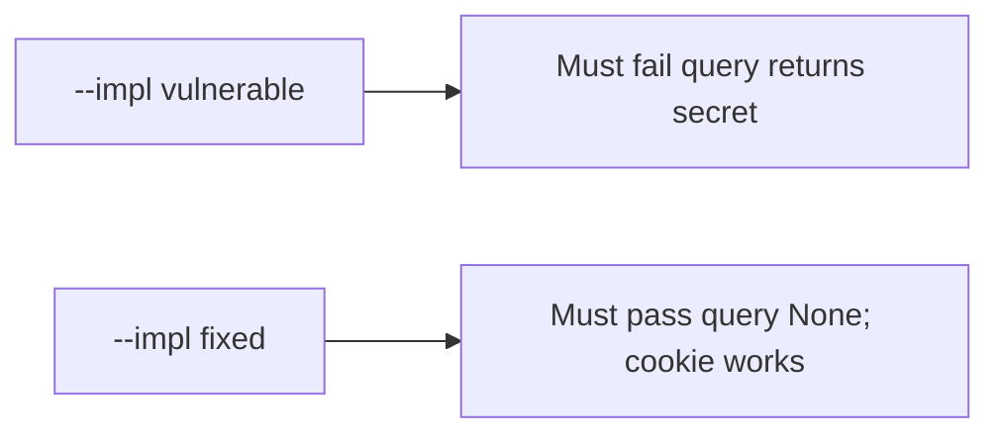

# 4.3-LO-05 — Evidence is query yields None, then a passing pair

**Kind:** verification-lab
**Loop step:** 5 Verify
**Standards:** OWASP ASVS 5.0.0 (final) `v5.0.0-14.2.1`.

## An invariant that cannot fail a test is still a slogan

“We set Referrer-Policy” is not evidence that the parser ignores query tokens. “HTTPS” is a hop observation. The oracle is: `session_from_request({"access_token": "secret"}, {}, None)` is `None`. That observation must be **false** on `--impl vulnerable` (returns `secret`) and **true** on `--impl fixed`.

## Mental model: vulnerable must fail: query returns secret

The failing observation on `--impl vulnerable` is **query returns secret**. A passing collection count is not this cell.



| Mode | Must show for this module |
|---|---|
| Normal | After the fix, cookie `sc_session` still works |
| Negative / abuse | query `access_token` → `None`; vulnerable must fail |
| Header | Authorization still works |
| Not claimed | Production Referer; magic-link (6.6); HttpOnly on the wire (2.3) |

Lab tests in `labs/4.3/4.3-lab/tests/test_property.py`. `test_query_string_token_is_rejected` is a **forbidden-outcome** test: a query-minted session is not allowed to count as a passing control.

```text
python3 -m pytest labs/4.3/4.3-lab/tests --impl vulnerable
python3 -m pytest labs/4.3/4.3-lab/tests --impl fixed
```

Map each test to an LO-02 cell. If vulnerable does not fail the query assertion, the lab is miswired—fix the wiring, not the assertion. Cookie and header honest-path tests may pass on both implementations; that does not excuse the query deny.

## What the tests do not prove

- HttpOnly flag on the wire (2.3)
- Log redaction of other fields (3.1)
- Clinic deep links (transfer)
- CORS header-token leakage (E2)

Record those as residuals or later modules, not as silent passes.

## Practice

Execute both implementations this session. Write the fail/pass pair next to the matrix row. Reject a “test” that only greps `Referrer-Policy` without calling `session_from_request` on a query dict.

## Transfer

Clinic deep link. A test that only asserts HTTP 200 is not channel evidence (see 9.3). A test that clicks a live SMS is out of scope.

## Non-goals

Do not add a live GET. Do not log `secret`. Keys stay out of this file.
