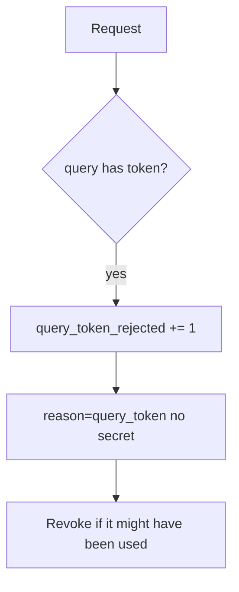

# 4.3-LO-06 — Detect query tokens; revoke without logging the secret again

**Kind:** operations-exercise
**Loop step:** 6 Operate
**Standards:** NIST CSF 2.0 (final) DE/RS/RC as outcome labels; OWASP ASVS 5.0.0 (final) `v5.0.0-14.2.1`. CSF names outcomes; it does not strip the query.

## Prevention is not absolute

A new magic link, a proxy that copies query into a header, or a screenshot can still leak after the parser was “fixed once.” Pair detect and recover. Do not log the token while investigating (3.1). Do not paste the URL into the ticket.

## Mental model: reject, metric, purge



| Outcome | This module |
|---|---|
| Detect | `query_token_rejected`; log-redact gateway |
| Signal | path, reason; never the token |
| Recover | Revoke; purge matching logs |
| Residual | History and screenshots you cannot purge |

CSF 2.0 Detect / Respond / Recover name outcomes. They do not prove `v5.0.0-14.2.1`. A SIEM product name is not the property. Re-run `test_query_string_token_is_rejected` after any parser change; a green TLS dashboard is not that pytest. History, screenshots, and chat pastes remain residuals you cannot purge — revoke the token anyway.

Recovery is incomplete if the next deploy still builds `?access_token=` in a Next.js share helper. Grep the frontend for query builders the same day you rotate the signing key (4.5), or the next copied URL re-issues the leak. uvicorn will keep printing the query unless the access-log format changes; detection still belongs in `session_from_request` before any log line is written.

## Framework defaults versus the operate guarantee

uvicorn will still print query strings unless you change the access-log format. Detection must happen **in the parser** before the token is copied into a log line. If the alert includes `secret`, you have duplicated the leak into the paging channel.

## Practice

Write one log line you would accept. Tie it to `labs/4.3/4.3-lab`.

```text
log_denied reason=query_token path=/notes request_id=req_43qs
```

Reject any line that includes `secret`, a note body, or a full URL with a query token.

## Transfer

Clinic: detect `?token=` on appointment links; do not paste the URL into the ticket. Do not fetch the SMS link.

## Non-goals

SIEM product names are not the property. Live log dumps are out of scope. Gates 0–10 stay not-attempted.
