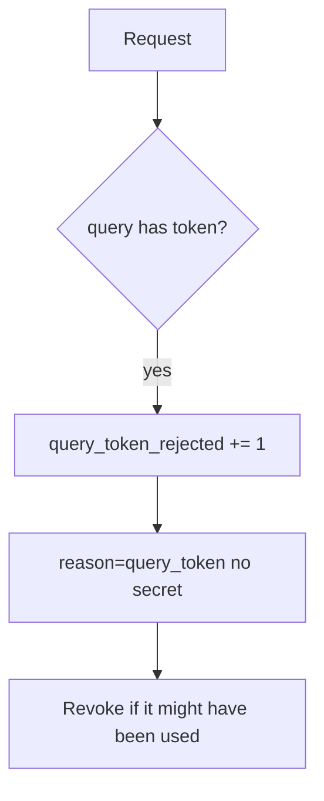

# 4.3-LO-06 — Detect query tokens; revoke without logging the secret again

**Kind:** operations-exercise
**Loop step:** 6 Operate
**Standards:** NIST CSF 2.0 (final) DE/RS/RC as outcome labels; OWASP ASVS 5.0.0 (final) `v5.0.0-14.2.1`.

## Prevention is not absolute

A new magic link, a proxy that copies query into a header, or a screenshot can still leak. Pair detect and recover. Do not log the token while investigating (3.1).

## Mental model: reject, metric, purge



| Outcome | This module |
|---|---|
| Detect | `query_token_rejected`; log-redact gateway |
| Signal | path, reason; never the token |
| Recover | Revoke; purge matching logs |
| Residual | History and screenshots you cannot purge |

## Practice

Write one log line you would accept. Tie it to `labs/4.3/4.3-lab`.

```
log_denied reason=query_token path=/notes request_id=req_43qs
```

Reject any line that includes `secret` or a note body.

## Transfer

Clinic: detect `?token=` on appointment links; do not paste the URL into the ticket.

## Non-goals

SIEM product names are not the property.
