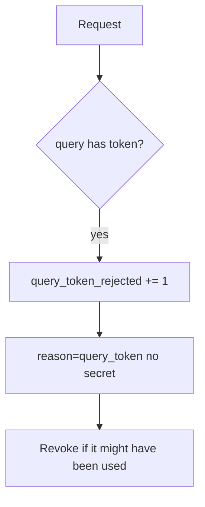

# Notice query tokens; revoke without logging the secret again

**Kind:** operations-exercise
**Loop step:** 6 Operate

## Fixing it once is not enough

A new magic link, a proxy that copies query into a header, or a screenshot can still leak after the parser was repaired once. Do not log the token while investigating. Leave the URL out of the ticket.

## Picture: reject, metric, purge



| Outcome | This topic |
|---|---|
| Notice | `query_token_rejected`; a log-redact gateway |
| What the line holds | path, reason; never the token |
| Recover | Revoke; purge matching logs |
| Leftover | History and screenshots you cannot purge |

A vendor name does not prove secrets stay out of the URL. A token in the query still has to fail `test_query_string_token_is_rejected`; a green TLS dashboard is not that check. History, screenshots, and chat pastes remain leftovers you cannot purge — revoke the token anyway.

Recovery is incomplete if the next deploy still builds `?access_token=` in a Next.js share helper. Grep the frontend for query builders the same day you rotate the signing key, or the next copied URL re-issues the leak. uvicorn will keep printing the query unless the access-log format changes; notice still belongs in `session_from_request` before any log line is written.

## What the framework does vs what you still have to check

uvicorn will still print query strings unless you change the access-log format. Notice must happen **in the parser** before the token is copied into a log line. If the alert includes `secret`, you have duplicated the leak into the pager.

## Practice

```text
log_denied reason=query_token path=/notes request_id=req_43qs
```

Reject any line that includes `secret`, a note body, or a full URL with a query token.

## Use it somewhere new

Notice `?token=` on appointment links; do not paste the URL into the ticket. Do not fetch the SMS link.

## What this page is not doing

Do not use live log dumps. This site does not mark you as finished.
