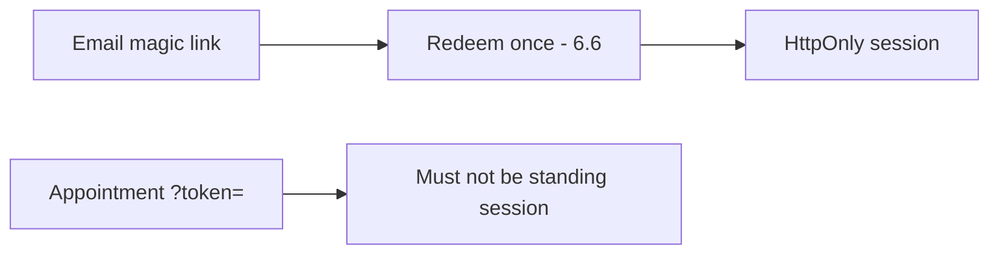

# 4.3-LO-07 — Transfer: clinic deep link and magic-link email

**Kind:** transfer-challenge
**Loop step:** 7 Transfer
**Standards:** OWASP ASVS 5.0.0 (final) `v5.0.0-14.2.1`.

## Change the link; keep query ≠ session

Do not answer with a Top 10 / CWE / scanner as the definition of security.

**Prompt:** Clinic appointment deep link. Optionally: magic-link email (still a URL token — time-bound, one-time, 6.6).

**Product sketch:** EHR-lite “open this visit” SMS or email.

Rewrite the SecureCollab sentence. Include:

1. attacker capabilities (Referer to a tracking pixel; SMS forward; access-log operator — not a live clinic);
2. trust assumptions (which parser is TCB; the SMS vendor is not);
3. forbidden outcome (`?token=` mints a standing session, not “HIPAA”);
4. a test idea on a **local** fixture only;
5. residual (one-time magic link still appears in mail logs; exchange it for a cookie);
6. WCAG 2.2 if a human must follow the link (usable, not color-only).

## Mental model: one-time URL is not a session cookie

## What graders reject

| Reject | Why |
|---|---|
| JWT as the property | Format ≠ channel |
| Live clinic SMS | Lab policy |
| “HTTPS so logs are fine” | TLS ≠ log |

## Practice

One page. No keys. `labs/4.3/4.3-lab` is the only running system you may break.
