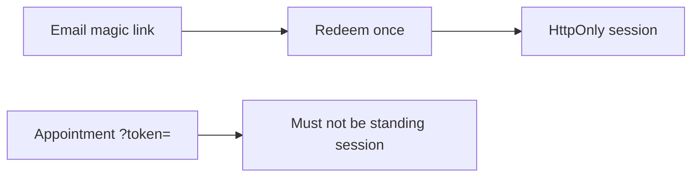

# Same idea on a clinic deep link and a magic-link email

**Kind:** transfer-challenge
**Loop step:** 7 Transfer

## Use it somewhere new

You get a **clinic appointment deep link**. Optionally: a **magic-link email** (still a URL token — short-lived, one-time). On the notes app, query `access_token` yields `None`. The same rule has to hold on a clinic link.

**Prompt:** Clinic appointment deep link. Optionally: magic-link email (still a URL token — short-lived, one-time).

**Product sketch:** EHR-lite “open this visit” SMS or email.

1. who can act (Referer to a tracking pixel; SMS forward; access-log operator — **not** a live clinic);
2. what you trust (which parser is trusted; the SMS vendor is not);
3. what must not happen (`?token=` mints a standing session, not a privacy-law name);
4. a test idea on a **local** practice only (query-only → `None`; cookie still works);
5. leftover (one-time magic link still appears in mail logs; exchange it for a cookie);
6. whether a human path must meet the web accessibility baseline (usable, not color-only, if a person must follow the link).

## Picture: one-time URL is not a session cookie

JWT as a format is not the channel. TLS does not erase the access log. FastAPI and Next.js will still put query params in the address bar unless the parser refuses them. A one-time magic link that is later exchanged for `sc_session` is later work; leaving `?token=` as the standing session is this rule.

Query `access_token` (or `?token=` on the appointment SMS) yields `None`, while a cookie or Bearer header with the same value may still work. Referer redaction and a scrubbed logger are sister cells, not this parser. The local check is `test_query_string_token_is_rejected` — against `labs/4.3/4.3-lab`, not a live appointment SMS.

## What is not good enough

| Reject | Why |
|---|---|
| JWT as the rule | Format ≠ channel |
| Live clinic SMS | Course rules |
| “HTTPS so logs are fine” | TLS ≠ log |
| Referrer-Policy as the parser | Sister rule |
| HTTP 200 as channel evidence | Wrong observation |

## Practice

One page. No keys. `labs/4.3/4.3-lab` is the only running system you may break. Do not click a live appointment SMS or dump mail logs.

## What this page is not doing

Live token replay. Real session cookies. Claiming a course gate from this page.
