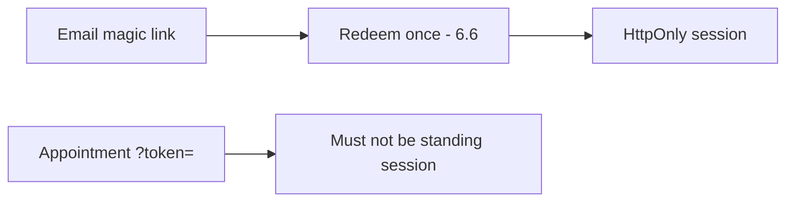

# 4.3-LO-07 — Transfer: clinic deep link and magic-link email

**Kind:** transfer-challenge
**Loop step:** 7 Transfer
**Standards:** OWASP ASVS 5.0.0 (final) `v5.0.0-14.2.1`. Module 6.6 owns one-time redeem; this module owns “URL is not a standing session.”

## Change the link; keep query ≠ session

Do not answer with a Top 10 / CWE / scanner as the definition of security. The SecureCollab sentence was: query `access_token` yields `None`. Rewrite it for a clinic link without changing the fork.

**Prompt:** Clinic appointment deep link. Optionally: magic-link email (still a URL token — time-bound, one-time, 6.6).

**Product sketch:** EHR-lite “open this visit” SMS or email.

Rewrite the SecureCollab sentence. Include:

1. attacker capabilities (Referer to a tracking pixel; SMS forward; access-log operator — **not** a live clinic);
2. trust assumptions (which parser is TCB; the SMS vendor is not);
3. forbidden outcome (`?token=` mints a standing session, not “HIPAA”);
4. a test idea on a **local** fixture only (query-only → `None`; cookie still works);
5. residual (one-time magic link still appears in mail logs; exchange it for a cookie);
6. WCAG 2.2 if a human must follow the link (usable, not color-only).

## Mental model: one-time URL is not a session cookie

JWT as a format is not the channel. TLS does not erase the access log. FastAPI and Next.js will still put query params in the address bar unless the parser refuses them. A one-time magic link that is later exchanged for `sc_session` is 6.6; leaving `?token=` as the standing session is this cell.

The clinic rewrite still has to keep the SecureCollab fork: query `access_token` (or `?token=` on the appointment SMS) yields `None`, while a cookie or Bearer header with the same value may still work. Referer redaction and a scrubbed logger are sister cells, not this parser. The local pytest analogue is `test_query_string_token_is_rejected` — against `labs/4.3/4.3-lab`, not a live appointment SMS.

## What graders reject

| Reject | Why |
|---|---|
| JWT as the property | Format ≠ channel |
| Live clinic SMS | Lab policy |
| “HTTPS so logs are fine” | TLS ≠ log |
| Referrer-Policy as the parser | Sister cell |
| HTTP 200 as channel evidence | Wrong observation |

## Practice

One page. No keys. `labs/4.3/4.3-lab` is the only running system you may break. Do not click a live appointment SMS or dump mail logs.

## Non-goals

Live token replay. Real session cookies. Claiming Gate 4 from this page.
