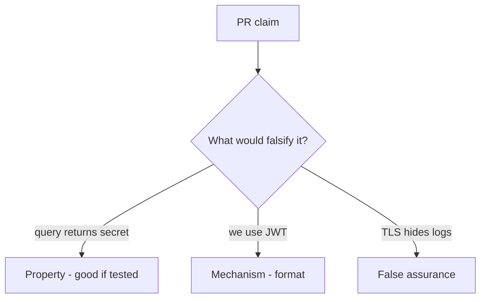

# 4.3-LO-08 — Review the query token as a PR, not a JWT debate

**Kind:** code-review
**Loop step:** Review
**Standards:** OWASP ASVS 5.0.0 (final) `v5.0.0-14.2.1`.

## Review the fixture as if it were SecureCollab session parsing

Review `labs/4.3/4.3-lab/vulnerable/` as a SecureCollab PR. Your job is not to count suspicious lines. Reconstruct whether `session_from_request` still returns the query token, compare that with the module invariant, and write changes a developer can verify.

Intended findings live only in `content/assessment/keys/4.3.md` — not here. Do not open the keys file until your review has been evaluated.

## Mental model: session_from_request uses query

Start with this seeded smell: **`session_from_request` uses query**. Label it property, mechanism, or false assurance before you accept the PR.

Classification starts at the protected effect (query yields `None`). Everything that is not a dropped query channel at that call is a candidate ambient path. “We use JWTs” and “SPA best practice” are mechanism slogans until the pytest fails on `--impl vulnerable`.

## Seeded smells (label them yourself)

- `session_from_request` uses query
- JWT in localStorage as “SPA best practice”
- No Referer policy
- Tokens printed in uvicorn logs

Also reject: client trust; closing findings without re-running `test_query_string_token_is_rejected`; keys in lessons; real tokens in fixtures; “HTTPS so logs are fine.”

## Misconceptions this module refuses

- Query strings are fine over TLS
- JWT means secure
- HttpOnly is the same as “not in the URL”
- NextAuth defaults are the channel guarantee
- Magic-link URL is a standing session

## Practice

Write three review notes a maintainer could act on. Each note: observation, property or false assurance, suggested structural change, residual you will **not** delete. Tie at least one to `test_query_string_token_is_rejected`.

## Transfer

Clinic deep-link PR that “adds a token query param for convenience” is an incomplete mediation review. Name the independent falsehood that would still keep query-only requests at `None`.

## Non-goals

Do not merge by adding a comment “will move to cookies later.” That comment is a residual without an owner. Do not dump live logs to prove the finding.
