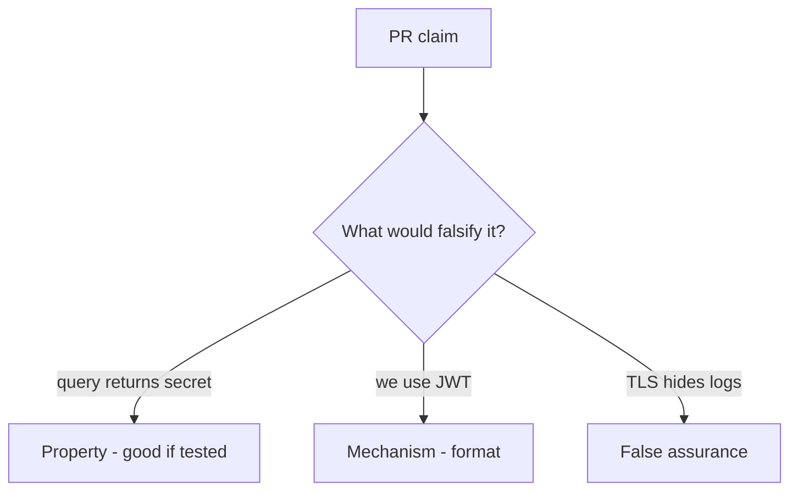

# 4.3-LO-08 — Review the query token as a PR, not a JWT debate

**Kind:** code-review
**Loop step:** Review
**Standards:** OWASP ASVS 5.0.0 (final) `v5.0.0-14.2.1`.

## Review the fixture as if it were SecureCollab session parsing

Review `labs/4.3/4.3-lab/vulnerable/` as a SecureCollab PR. Intended findings live only in `content/assessment/keys/4.3.md` — not here.

## Mental model: session_from_request uses query

Start with this seeded smell: **`session_from_request` uses query**. Label it property, mechanism, or false assurance before you accept the PR.

Seeded smells (label them yourself; do not open the keys file):

- `session_from_request` uses query
- JWT in localStorage as “SPA best practice”
- No Referer policy
- Tokens printed in uvicorn logs

Also reject: client trust, closing findings without retest, keys in lessons, real tokens in fixtures.

## Misconceptions

- Query strings are fine over TLS
- JWT means secure
- HttpOnly is the same as “not in the URL”

## Practice

Write three review notes. Tie at least one to `test_query_string_token_is_rejected`.

## Transfer

Clinic deep-link PR that “adds a token query param for convenience” is incomplete.
