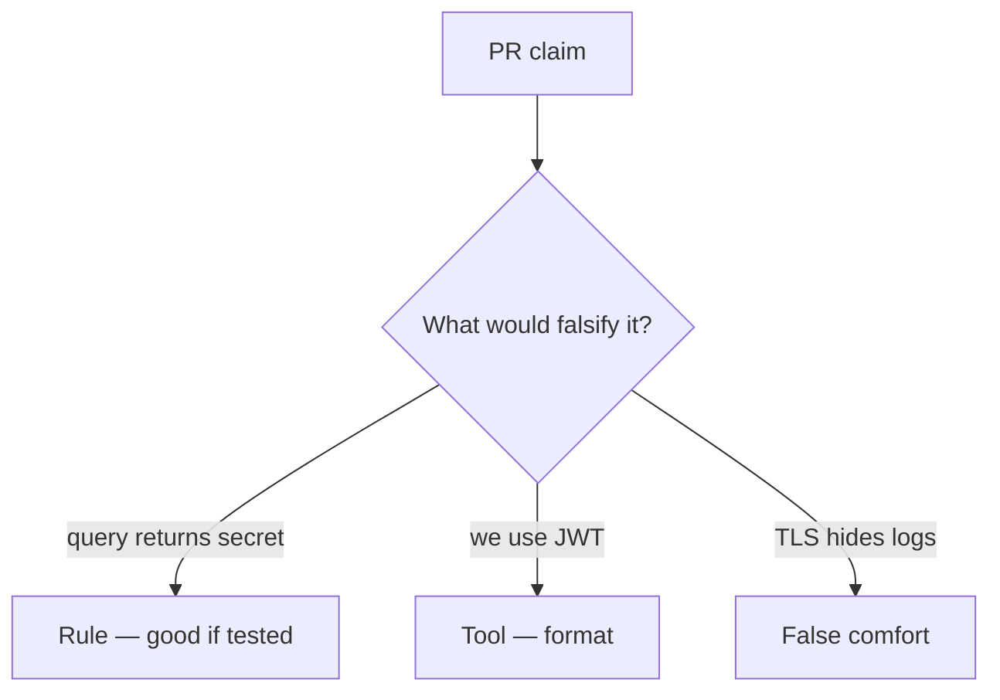

# Review of a query-string session token

**Kind:** code-review
**Loop step:** Review

Intended findings live only in the answer-key folder — not here. Do not open that file until your review has been evaluated.

## What you are reviewing

A colleague ships notes-app session parsing. Review `labs/4.3/4.3-lab/vulnerable/` as that change. Your job is not to count suspicious lines. Reconstruct whether `session_from_request` still returns the query token, compare that with the rule, and write changes a developer can verify.

The check you already ran (`test_query_string_token_is_rejected`) is the rule test. A comment “will move to cookies later” is not.

## Picture: session_from_request uses query

Start with this seeded smell: **`session_from_request` uses query**. Label it rule, tool, or false comfort before you accept the change.

Classification starts at the protected effect (query yields `None`). Everything that is not a dropped query channel at that call is a candidate leftover path. “We use JWTs” and “SPA best practice” are tool slogans until the pytest fails on the broken files.

## Problems to find (name them yourself)

- `session_from_request` uses query
- JWT in localStorage as “SPA best practice”
- No Referer policy
- Tokens printed in uvicorn logs

Also reject: treating the client as what you trust; closing findings without re-running `test_query_string_token_is_rejected`; keys in learner notes; real tokens in fixtures; “HTTPS so logs are fine.”

## Common mix-ups

- Query strings are fine over TLS
- JWT means secure
- HttpOnly is the same as “not in the URL”
- NextAuth defaults are the channel guarantee
- Magic-link URL is a standing session

## Practice

Write three review notes a maintainer could act on. Each note: what you saw, rule or false comfort, suggested structural change, leftover you will **not** delete. Tie at least one to `test_query_string_token_is_rejected`. Do not open the keys file.

## Use it somewhere new

Clinic deep-link change that “adds a token query param for convenience” is an incomplete review. Name the independent falsehood that would still keep query-only requests at `None`.

## What this page is not doing

Do not merge by adding a comment “will move to cookies later.” That comment is leftover risk without an owner. Do not dump live logs to prove the finding.
