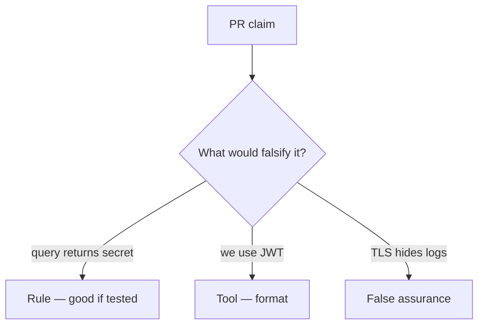

# Review of a query-string session token

**Kind:** code-review
**Loop step:** Review

Wait until someone has looked at your review before opening the keys.

## What you are reviewing

Review `labs/4.3/4.3-lab/vulnerable/` as a change to notes-app session parsing. Check whether `session_from_request` still returns the query token.

The check you already ran (`test_query_string_token_is_rejected`) is the rule test. A comment “will move to cookies later” is not.

## Picture: session_from_request uses query

**`session_from_request` uses query**.

The query still has to yield `None`. If the change never drops the query channel, that leftover path is still open. “We use JWTs” and “SPA best practice” are tool slogans until the check fails on the broken files.

## Problems to find (name them yourself)

- `session_from_request` uses query
- JWT in localStorage as “SPA best practice”
- No Referer policy
- Tokens printed in uvicorn logs

Also reject: treating the client as what you trust; closing findings without re-running `test_query_string_token_is_rejected`; keys in learner notes; real tokens in practice files; “HTTPS so logs are fine.”

## Common mix-ups

- Query strings are fine over TLS
- JWT means secure
- HttpOnly is the same as “not in the URL”
- NextAuth defaults are the channel guarantee
- Magic-link URL is a standing session

## Practice

Write the review that blocks this change. Mention `test_query_string_token_is_rejected`.

## Use it somewhere new

Clinic deep-link change that “adds a token query param for convenience” is an incomplete review. Name the independent falsehood that would still keep query-only requests at `None`.

## What this page is not doing

Do not merge by adding a comment “will move to cookies later.” That comment is leftover risk without an owner. Do not dump live logs to prove the finding.
