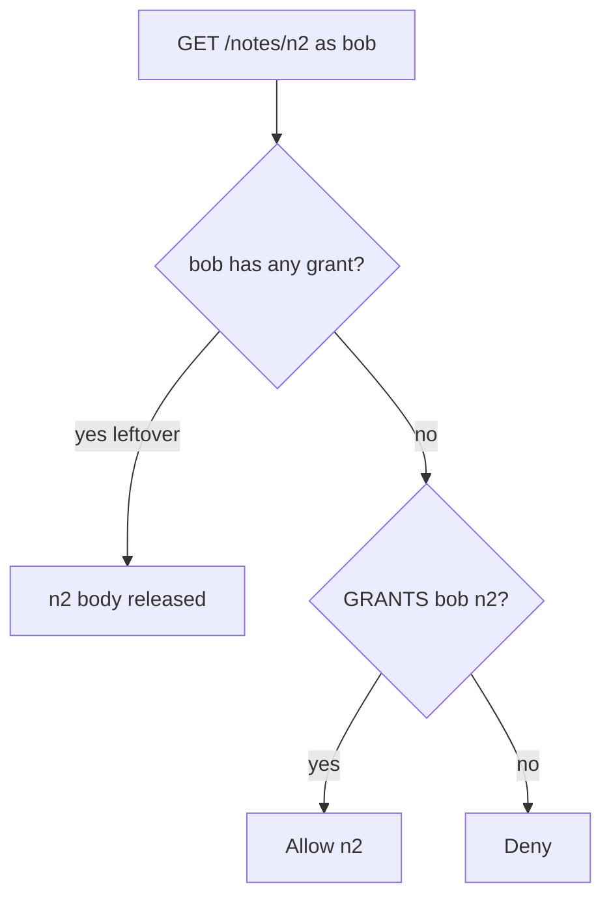
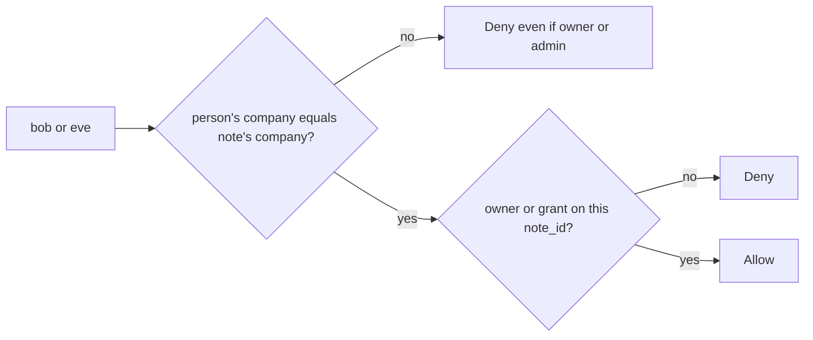

# A grant on note 1 is not a grant on note 2

**Kind:** concept-model
**Loop step:** 1 Property

## The rule

The notes app stores notes per company. Bob has a share on note `n1` in company `acme`. That share is one row: Bob may read `n1`. It is not a yes for `n2`. It is not a yes for `n3` in company `clinic`. Being signed in and “having shared something” is leftover permission. A FastAPI `Depends(get_user)` answers who is speaking. It does not answer whether this note may be read.

> After seed, `can_read("bob", "n2")` must be false. `can_read("alice", "n3")` must be false even though Alice owns notes. `can_read("eve", "n1")` must be false even though Eve’s role is `admin`. A hard-to-guess id is not a grant. Roles, attributes, relationship graphs, and capability tokens are shapes for writing the table. The rule is still the rule: this person, this action, this note, this company.

A **grant on n1 must not authorize n2**, and an **owner or admin costume must not walk into another company**. That is a secrecy failure because who-is-allowed never ran on the requested object.

Function permissions and data-item permissions have to be checked on a trusted server, not in the Next.js client. They also want work never to hit another company’s rows. Extra rows about applying grant changes immediately, and carrying the original person through a worker, are advanced — not this check. Famous “broken object / property / function” lists are a later awareness check after this table exists. They are not the syllabus.

## Picture: a collection flag vs a grant on this note

Treat leftover permission as a boolean that says “Bob has a share somewhere,” then treats that as a yes for every note.



Picture a member with a real grant on `n1` who swaps `note_id`, or someone guessing ids. Trusting “they are a collaborator” as a boolean is not what you trust.

Casbin, OPA, a database row rule, and a signed note id do not make a grant on n1 fail for n2.

## Picture: company is a second key, not a costume



A later database-role check is a *second* gate. This table is still required. A clinic admin named Eve is not an `acme` capability.

## Why it happens, what it costs, how you stop it, how you notice, how you recover

| Slice | For this rule |
|---|---|
| Why it happens | A collection-level “has any grant” flag, or a role string treated as a grant |
| What's already wrong | `can_read(bob, n2)` is true because Bob has n1; or owner/admin leftover |
| Trigger | Client-supplied `note_id` or a guessed id |
| What it costs | Secrecy of n2 / clinic notes; the who-is-allowed check never ran |
| How you stop it | Deny-by-default lookup `(person, company, note_id)` on every path |
| How you notice | A deny count by object and company; grant-table drift |
| How you recover | Take back the leftover flag; audit Bob’s reads of n2 |

## What the framework does vs what you still have to check

`Depends(get_user)` is not `Depends(can_read_note)`. Starlette, Next.js middleware, and “the user is logged in” do not key the grant. A later PostgreSQL row-level rule does not replace this rule. This lookup is the check — files in `labs/4.4/4.4-lab`. No live company.

## What the tool cannot do

- A hard-to-guess id is not a grant.
- GraphQL `node(id)`, an export zip, a search index, and workers are other paths of the same rule.
- Title vs body is a later field-level topic. This week is object plus company.
- An honest grant on n1 still reveals n1 — that is the product.

## Practice

Name person, company, object, and action. Then run:

```text
python3 -m pytest labs/4.4/4.4-lab/tests --impl vulnerable
python3 -m pytest labs/4.4/4.4-lab/tests --impl fixed
```

The first command must fail on the deny tests. The second must pass. Map failures to `can_read("bob", "n2")`, not to a scanner bug name.

## Use it somewhere new

A grant on appointment A is not a grant on chart B.

## What this page is not doing

Do not use live companies, real charts, weaponized id guessing, or a famous-bugs list as the definition of the rule. This page does not finish a check-in. Answer keys are not on this site.
