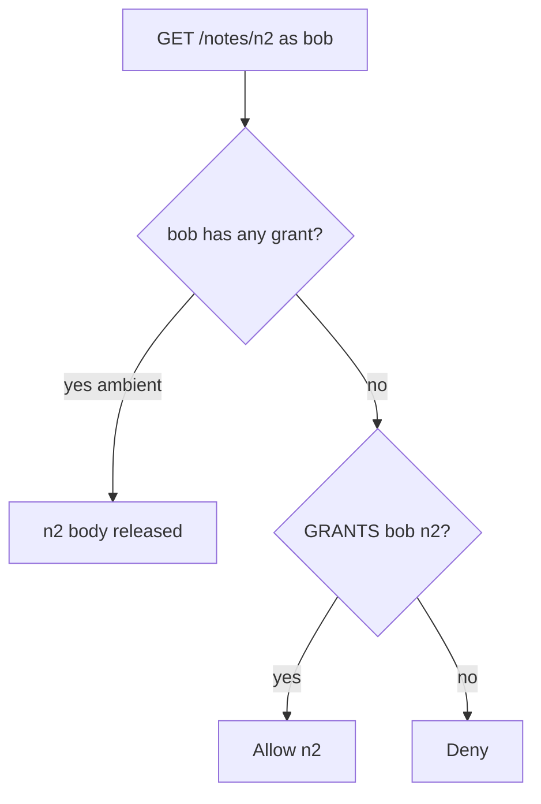
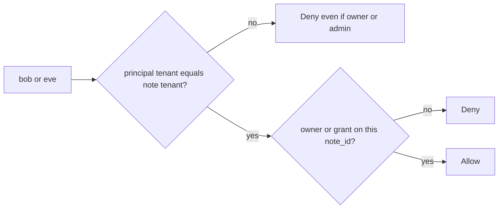

# 4.4-LO-01 — A grant on n1 is not a grant on n2

**Kind:** concept-model
**Loop step:** 1 Property
**Standards:** Saltzer and Schroeder (1975, seminal) complete mediation and fail-safe defaults; OWASP ASVS 5.0.0 (final) `v5.0.0-8.2.1`, `v5.0.0-8.2.2`, `v5.0.0-8.3.1`, `v5.0.0-8.4.1`; `v5.0.0-8.3.2` and `v5.0.0-8.3.3` are **Level 3, advanced**. OWASP API Security Top 10:2023 API1/API3/API5 are **awareness** after the matrix, not the syllabus.

## The claim this module owns

SecureCollab Phase 1 stores notes in tenants. Bob has a share grant on `n1` in tenant `acme`. That grant is a 1.2 cell: `(bob, read, n1)`. It is not `(bob, read, n2)` and it is not `(bob, read, n3)` in tenant `clinic`. Login plus “shared something” is ambient authority. A FastAPI `Depends(get_user)` is authentication, not authorization.

> After seed, `can_read("bob", "n2")` must be false. `can_read("alice", "n3")` must be false even though alice owns notes. `can_read("eve", "n1")` must be false even though eve’s role is `admin`. UUID obscurity is not a grant. RBAC, ABAC, ReBAC, and capabilities are policy *shapes*; the property is the cell.

The forbidden outcome is **grant on n1 authorizes n2**, plus the sibling **role or owner costume crosses tenants**. That is a 1.1 confidentiality failure because 1.2 never ran on the requested object.

ASVS `v5.0.0-8.2.1` wants function permissions; `v5.0.0-8.2.2` wants data-item permissions; `v5.0.0-8.3.1` wants enforcement at a trusted service layer, not the Next.js client. `v5.0.0-8.4.1` wants cross-tenant controls so operations never affect another tenant. `v5.0.0-8.3.2` (apply grant changes immediately) and `v5.0.0-8.3.3` (originating subject through a worker) are **Level 3 (advanced)** — not a silent baseline. API1/API3/API5 name broken object, property, and function authorization as awareness regression after this matrix exists.

## Mental model: collection flag vs object-keyed grant



The attacker is a member with a real grant on `n1` who swaps `note_id`, or an enumerator of ids. Trusting “they are a collaborator” as a boolean is not a TCB.

**Mechanism (not the property):** Casbin, OPA, RLS, or a signed note id.

## Mental model: tenant is a second key, not a role costume



Module 3.3 adds a database role as a *second* mediation. This module’s table is still required. A clinic admin named `eve` is not an acme capability.

## Root cause vs impact vs prevention vs detection vs recovery

| Slice | For this property |
|---|---|
| Root cause | Collection-level “has any grant” flag, or a role string treated as a grant |
| Preconditions | `can_read(bob, n2)` true because bob has n1; or owner/admin ambient |
| Trigger | Client-supplied `note_id` or guessed UUID |
| Impact | Confidentiality of n2 / clinic notes; 1.2 cell missing |
| Prevention | Deny-by-default lookup `(subject, tenant, note_id)` on every path |
| Detection | `authz_deny` by object and tenant; grant-table drift |
| Recovery | Revoke the ambient flag; audit bob’s reads of n2 |

## Framework defaults versus the grant guarantee

`Depends(get_user)` is not `Depends(can_read_note)`. Starlette, Next.js middleware, and “the user is logged in” do not key the grant. PostgreSQL RLS waits for 5.5 and does not replace this cell. Oracle: `labs/4.4/4.4-lab`. No live tenant.

## Mechanism limits

- UUID obscurity is not a grant.
- GraphQL `node(id)`, export zip, search index (2.2), workers (7.4) are other paths of the same cell.
- Property-level title-vs-body is 7.2; this lab is object + tenant.
- Honest grant on n1 still reveals n1 — that is the product.

## Practice

Name subject, tenant, object, and action. Then run:

```
python3 -m pytest labs/4.4/4.4-lab/tests --impl vulnerable
python3 -m pytest labs/4.4/4.4-lab/tests --impl fixed
```

The first command must fail on the deny tests. The second must pass. Map failures to `can_read("bob", "n2")`, not to “IDOR.”

## Transfer

Clinic: grant on appointment A is not a grant on chart B.

## Non-goals

Live tenants, real charts, weaponized id enumerators, Top 10 as the definition of the cell. Gates 0–10 and milestones M0–M5 stay **not-attempted** without learner or product evidence. Answer keys are not in this file.
