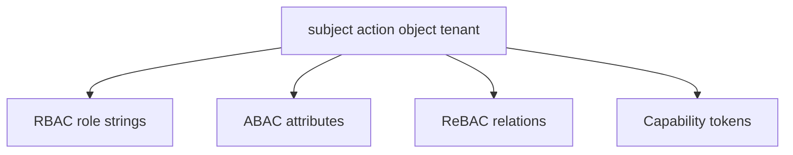
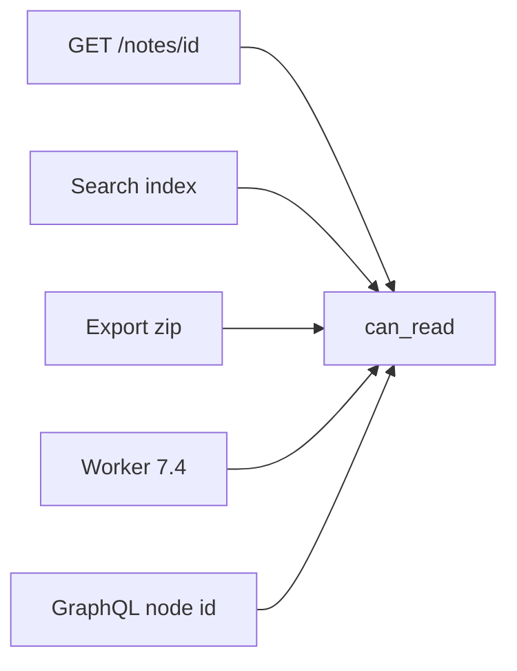

# 4.4-LO-02 — A matrix a second engineer can test

**Kind:** design-exercise
**Loop step:** 2 Model
**Standards:** Saltzer and Schroeder (1975, seminal) complete mediation; OWASP ASVS 5.0.0 (final) `v5.0.0-8.2.1`, `v5.0.0-8.2.2`, `v5.0.0-8.4.1`.

## Can a second engineer name pytest cases from your matrix?

“We check authorization” is not this lesson. A reviewable model names **subjects, tenants, notes, actions, and every path** that can release a body.

SecureCollab Phase 1 freeze: local `GRANTS` / `NOTES` / `USERS`. Users `alice`, `bob`, `carol`, `eve`. No live IdP.

## Mental model: four policy shapes, one cell

RBAC (`member`, `owner`, `admin`) is a compact way to *write* many cells. It is not a substitute for looking up the object. ABAC and ReBAC change how you store the grant. A capability is a grant you can hold; a signed id is not automatically a capability.

## Mental model: every path is a cell

If a path is missing from the matrix, ambient authority appears there even if GET is correct. This lab executes GET-shaped `can_read` only.

## Step 1: freeze pieces

| Piece | This system |
|---|---|
| Subjects | bob (acme member with n1 grant); alice (acme owner); carol (clinic owner); eve (clinic admin); note-id enumerator |
| Objects | n1, n2 (acme); n3 (clinic); grant row |
| Actions | `can_read` |
| Channels | `GET /notes/{id}`; later search/export/worker |
| TCB | Lookup `(subject, tenant, note_id)` deny-default |
| Untrusted | Client `note_id`; “I’m a collaborator” boolean; admin role costume |
| State / time | Grant revoked on n1 must not linger (4.1 / 2.4) |
| 1.1 cell | Confidentiality / authorization |

## Step 2: write cells

| Subject | Object | Action | Decision |
|---|---|---|---|
| bob | n1 | read | allow-if-granted |
| bob | n2 | read | deny |
| alice | n2 | read | allow-owner |
| alice | n3 | read | deny (cross-tenant) |
| eve | n1 | read | deny (admin ≠ acme) |
| eve | n3 | read | deny (admin ≠ object grant) |
| anon | n1 | read | deny |

## Practice

Draw this map so a second engineer could name pytest cases. Point at `labs/4.4/4.4-lab` file `grant.py`.

## Transfer

Clinic appointment A vs chart B. Title vs body is 7.2.

## Residual risk

Search, export, GraphQL, and workers are named holes. 3.3 DB role and 5.5 RLS are additional mediations, not this table.

## Non-goals

Top 10 as the definition of security. Keys stay out of lessons.
