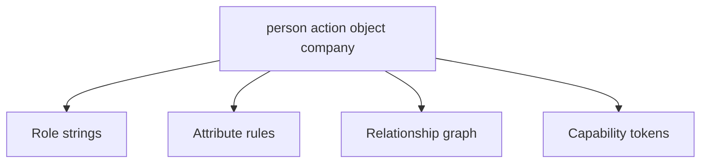
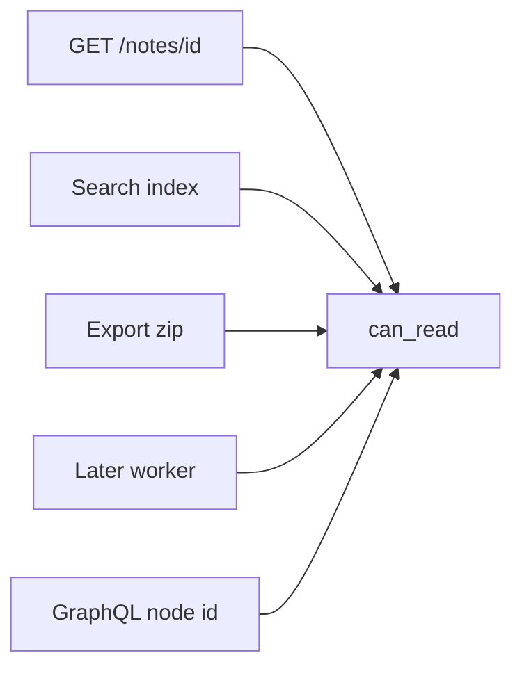

# A table someone else can test

**Kind:** design-exercise
**Loop step:** 2 Model

## Could someone else name the checks from your table?

“We check authorization” is not this page. A table someone else can test names **people, companies, notes, actions, and every path** that can release a body.

This week’s freeze: local `GRANTS` / `NOTES` / `USERS`. People `alice`, `bob`, `carol`, `eve`. No live identity product.

## Picture: four shapes, one cell

Roles (`member`, `owner`, `admin`) are a compact way to *write* many cells. They are not a substitute for looking up the object. Attributes and relationships change how you store the grant. A capability is a grant you can hold; a signed id is not automatically a capability.

## Picture: every path is a cell

If a path is missing from the table, leftover permission appears there even if GET is correct. This lab runs GET-shaped `can_read` only.

## Step 1: freeze pieces

| Piece | This system |
|---|---|
| People | bob (acme member with n1 grant); alice (acme owner); carol (clinic owner); eve (clinic admin); someone guessing note ids |
| Objects | n1, n2 (acme); n3 (clinic); grant row |
| Actions | `can_read` |
| Paths | `GET /notes/{id}`; later search/export/worker |
| What you trust | Lookup `(person, company, note_id)` deny-default |
| What you do not trust | Client `note_id`; “I’m a collaborator” boolean; admin role costume |
| Time | A grant taken back on n1 must not linger |
| The rule | Secrecy / who-is-allowed |

## Step 2: write cells

| Person | Object | Action | Decision |
|---|---|---|---|
| bob | n1 | read | allow-if-granted |
| bob | n2 | read | deny |
| alice | n2 | read | allow-owner |
| alice | n3 | read | deny (other company) |
| eve | n1 | read | deny (admin ≠ acme) |
| eve | n3 | read | deny (admin ≠ object grant) |
| anon | n1 | read | deny |

## Practice

Look in `labs/4.4/4.4-lab`, starting with `grant.py`.

## Use it somewhere new

Clinic appointment A vs chart B. Title vs body is a later field-level topic.

## What can still go wrong

Search, export, GraphQL, and workers are named holes. A later database-role check and a later row-level rule are extra gates, not this table.

## What this page is not doing

Do not treat a famous-bugs list as the definition of security. Answer keys are not on this site.
