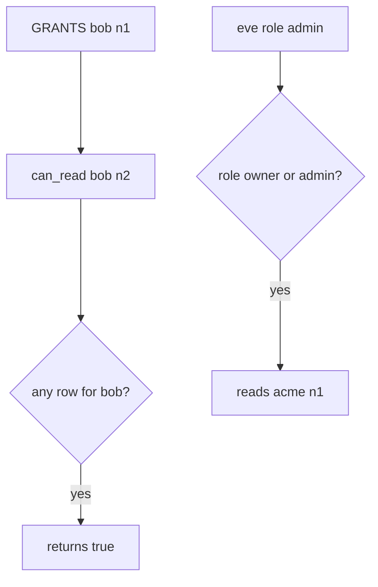

# 4.4-LO-03 — Observe the ambient grant, do not trophy an IDOR

**Kind:** mechanism-lab
**Loop step:** 3 Break
**Standards:** OWASP ASVS 5.0.0 (final) `v5.0.0-8.2.2` and `v5.0.0-8.4.1`.

## Authorized scope

`labs/4.4/4.4-lab` only. Synthetic notes `n1`/`n2`/`n3`. No live tenants.

**Forbidden outcome:** Grant on n1 authorizes n2 (and owner/admin costumes that cross tenants or skip the object key).

## Mental model: any-grant becomes every-note



The vulnerable tree demonstrates **cause** (wrong lookup key), not a trophy dump of another tenant’s note body.

## What to read in the fixture

`vulnerable/grant.py` `can_read` returns true if *any* grant exists for the user, or if the user’s role is `owner` or `admin`. It never compares `note_id` or tenant. Tests require n2, n3, and eve×n1 to stay false, and honest n1 / owner-n2 to stay true.

## Root cause vs impact

| Slice | Lab |
|---|---|
| Root cause | Collection-level flag and role costume |
| Impact | Unauthorized read of n2 or clinic notes |
| Not the lesson | A scanner “IDOR” name as the definition |

## Practice

```
python3 -m pytest labs/4.4/4.4-lab/tests --impl vulnerable
```

Record `test_grant_on_n1_is_not_grant_on_n2` and the cross-tenant names. Do not weaken them to “bob is logged in.”

## Transfer

Clinic: shared appointment A, swapped chart id. Predict without leaving this directory.

## Non-goals

No live-target instructions. Synthetic data only.
