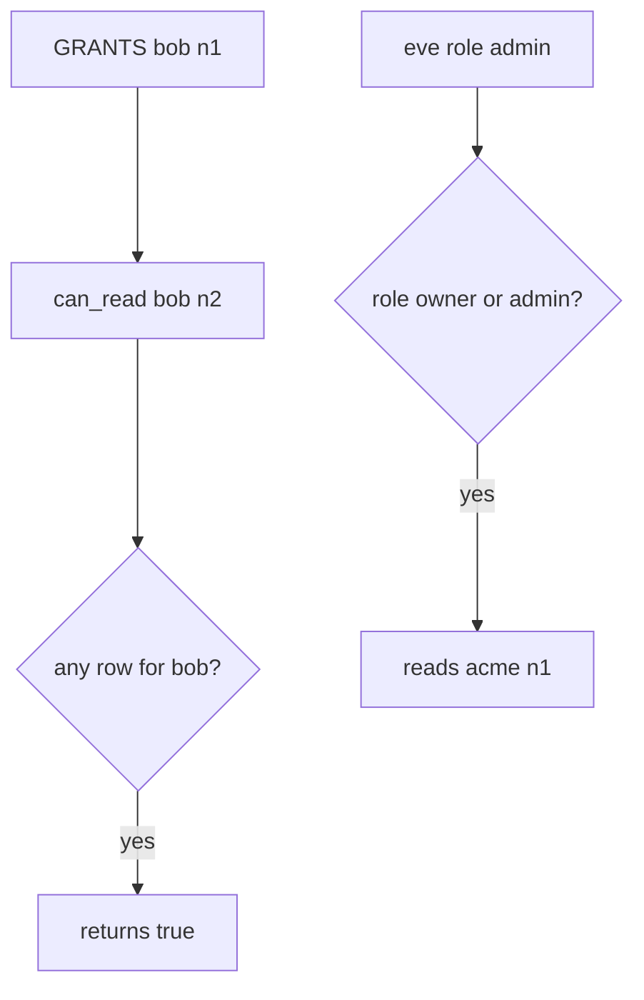

# 4.4-LO-03 — Observe the ambient grant, do not trophy an IDOR

**Kind:** mechanism-lab
**Loop step:** 3 Break
**Standards:** OWASP ASVS 5.0.0 (final) `v5.0.0-8.2.2` and `v5.0.0-8.4.1`. API1 is **awareness**, not this oracle.

## Authorized scope

`labs/4.4/4.4-lab` only. The fixture is an in-process `can_read`. Synthetic notes `n1`/`n2`/`n3` and tenants `acme`/`clinic`. It does not open FastAPI or PostgreSQL. Do not enumerate ids against a live tenant, an employer API, or a classmate preview.

**Forbidden outcome:** grant on n1 authorizes n2, plus owner/admin costumes that cross tenants or skip the object key. `can_read("bob", "n2")` is true.

Attacker capability in this lab: a member with a real grant on `n1` who can swap `note_id`, or an enumerator of ids. That stands in for alice (acme owner) reading clinic `n3`, or eve (`admin` in clinic) reading acme `n1`. Trust assumption: `can_read` is supposed to key `(subject, tenant, note_id)`. `Depends(get_user)`, Casbin, and UUID length are not in the TCB for this cell.

## Mental model: any-grant becomes every-note



The vulnerable tree demonstrates **cause** (wrong lookup key), not a trophy dump of another tenant’s note body. Preconditions: `can_read` returns true if *any* grant exists for the user, or if role is `owner`/`admin`. You do not need a live GET. You must not enumerate a live API.

ASVS `v5.0.0-8.2.2` wants data-item permissions. A scanner “IDOR” name is a weakness label, not that cell.

## What to read in the fixture

`vulnerable/grant.py` never compares `note_id` or tenant. Tests require n2, n3, and eve×n1 to stay false, and honest n1 / owner-n2 to stay true. Record `test_grant_on_n1_is_not_grant_on_n2` first.

Do not open the fixed tree yet. Diagnose the cause first.

## Root cause vs impact vs prevention vs detection vs recovery

| Slice | This lab |
|---|---|
| Required property | Grant on n1 does not authorize n2 |
| Root cause | Collection-level flag and role costume |
| Preconditions | `can_read(bob, n2)` true because bob has n1 |
| Trigger | Client-supplied `note_id` (modeled as `can_read("bob", "n2")`) |
| Impact | Confidentiality of n2 / clinic notes; 1.2 cell missing |
| Prevention | Deny-by-default lookup `(subject, tenant, note_id)` on every path |
| Detection | `authz_deny` by object and tenant |
| Recovery | Revoke the ambient flag; audit bob’s reads of n2 |
| Not the lesson | A scanner “IDOR” name, RBAC product, or UUID length |

## Framework defaults versus the grant guarantee

`Depends(get_user)` is not `Depends(can_read_note)`. Starlette and Next.js middleware do not key the grant. The application guarantee is: **this** fixture, `can_read("bob", "n2") is False`.

## Practice

```text
python3 -m pytest labs/4.4/4.4-lab/tests --impl vulnerable
```

Record `test_grant_on_n1_is_not_grant_on_n2` and the cross-tenant names. Do not weaken them to “bob is logged in.” An environment error is not security evidence.

## Transfer

Clinic: shared appointment A, swapped chart id. Predict without leaving this directory. Do not hit a live EHR.

## Non-goals

No live-target id enumerators. Synthetic note ids only.
