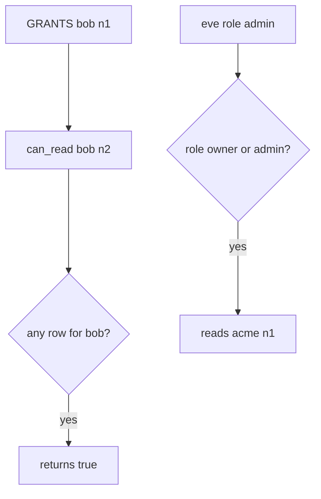

# Practice: a grant on n1 authorizes n2

**Kind:** mechanism-lab
**Loop step:** 3 Break

## Try it

The practice is not a website you attack. `can_read` is a tiny Python helper. The failure is already in the function: it treats “Bob has a share somewhere” as a yes for every note. That is a **failed rule**, not a dump of another company’s body.

> A grant on n1 does not authorize n2. If `can_read("bob", "n2")` is true because Bob has n1, leftover permission has replaced the rule.

## Where you may practice

Stay inside `labs/4.4/4.4-lab`. The check is in-process `can_read`. Notes `n1` / `n2` / `n3` and companies `acme` / `clinic` are fake. It does not open FastAPI or PostgreSQL. Do not guess ids against a live company, an employer API, or a classmate preview.

What must not happen: a grant on n1 authorizes n2, plus owner/admin costumes that cross companies or skip the object key. `can_read("bob", "n2")` is true.

Who could do this: a member with a real grant on `n1` who can swap `note_id`, or someone guessing ids. That stands in for Alice (acme owner) reading clinic `n3`, or Eve (`admin` in clinic) reading acme `n1`. What is supposed to stop this: `can_read` is supposed to key `(person, company, note_id)`. `Depends(get_user)`, Casbin, and id length are not enough.

## Picture: any-grant becomes every-note



The broken files show **cause** (wrong lookup key), not a dump of another company’s note body. What has to be true first: `can_read` returns true if *any* grant exists for the user, or if role is `owner` / `admin`. You do not need a live GET. You must not guess ids on a live API.

A scanner “IDOR” name is a weakness label, not that rule.

## What to look at: the cause, not a hunt

`vulnerable/grant.py` never compares `note_id` or company. Tests require n2, n3, and eve×n1 to stay false, and honest n1 / owner-n2 to stay true. Record `test_grant_on_n1_is_not_grant_on_n2` first.

## Why it happens vs what it costs

| Slice | Practice |
|---|---|
| Required rule | Grant on n1 does not authorize n2 |
| Why it happens | Collection-level flag and role costume |
| What has to be true first | `can_read(bob, n2)` true because Bob has n1 |
| Trigger | Client-supplied `note_id` (modeled as `can_read("bob", "n2")`) |
| What it costs | Secrecy of n2 / clinic notes; the who-is-allowed check never ran |
| How you stop it later | Deny-by-default lookup `(person, company, note_id)` on every path |
| How you notice later | A deny count by object and company |
| How you recover later | Take back the leftover flag; audit Bob’s reads of n2 |
| Out of scope | A scanner “IDOR” name, a roles product, or id length |

`Depends(get_user)` is not `Depends(can_read_note)`. Starlette and Next.js middleware do not key the grant. What this practice is supposed to show: `can_read("bob", "n2") is False`.

## Practice

```text
python3 -m pytest labs/4.4/4.4-lab/tests --impl vulnerable
```

Record `test_grant_on_n1_is_not_grant_on_n2` and the cross-company names. Do not weaken them to “Bob is logged in.” A setup error is not proof the rule holds.

## Use it somewhere new

A clinic example: shared appointment A, swapped chart id. Predict without leaving this directory. Do not hit a live clinic system.

## What this page is not doing

No live-target id guessing. Fake note ids only. Do not “fix” the practice by deleting the test.
