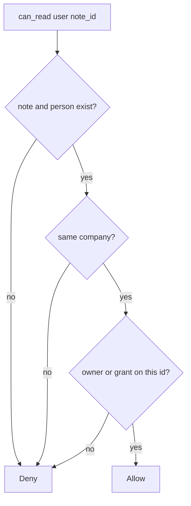

# Key the grant by company and note id

**Kind:** design-exercise
**Loop step:** 4 Build

## The rule

A denylist of yesterday’s ids is not the fix. Hiding the button is not the fix. Id length is not the fix. “They are a collaborator” is not the fix.

The structural change is: `can_read` **denies unless company matches and the user is the note owner or `GRANTS[(user, note_id)]` is true**. Structural means this object is checked — not leftover permission from the surroundings.

The smallest restore for notes-app notes is: deny by default, then company equality, then owner or grant on **this** id. Fail closed: missing note, missing user, or missing grant is **deny**. Do not fail open because the id “looks valid.”

## Picture: deny default, then two keys



The repaired files compare company, then owner or grant. A later database-role check is a *second* gate; this table is still required. A clinic admin named Eve is not an `acme` capability. A later PostgreSQL row-level rule does not replace this rule.

The check belongs on a trusted server, not in the Next.js client. This week's check is about `can_read`. Extra rows about applying grant changes immediately, and carrying the original person through a worker, are advanced — not this week's check.

## What the repaired files must show

| After the fix | Must be true |
|---|---|
| bob × n1 | allow (honest grant) |
| bob × n2 | deny |
| alice × n2 | allow (owner) |
| alice × n3 | deny (other company) |
| eve × n1 | deny (admin ≠ acme) |
| eve × n3 | deny (admin ≠ object grant) |

## What this is not

`Depends(get_user)`. Signed ids as capabilities. A Casbin file without tests. A row-level rule as a substitute. A worker `user_id` as the person. A famous-bugs label as the finding title.

## What the tool cannot do

- A hard-to-guess id is not a grant.
- GraphQL `node(id)`, an export zip, a search index, and workers are other paths of the same rule.
- Title vs body is a later field-level topic. This week is object plus company.
- An honest grant on n1 still reveals n1 — that is the product.
- How fast a taken-back grant dies is an advanced leftover.

## Practice

Name person, company, object, and the check. Run:

```text
python3 -m pytest labs/4.4/4.4-lab/tests --impl fixed
```

## Use it somewhere new

A clinic example: an appointment grant table keyed by chart id and company, not by “clinician role.”

## What can still go wrong

Search / export / GraphQL paths; grant take-back lag; honest n1 still readable; a later database-role check still required.

## What this page is not doing

Do not connect a live company. Do not claim a course gate from a roles-product name.
