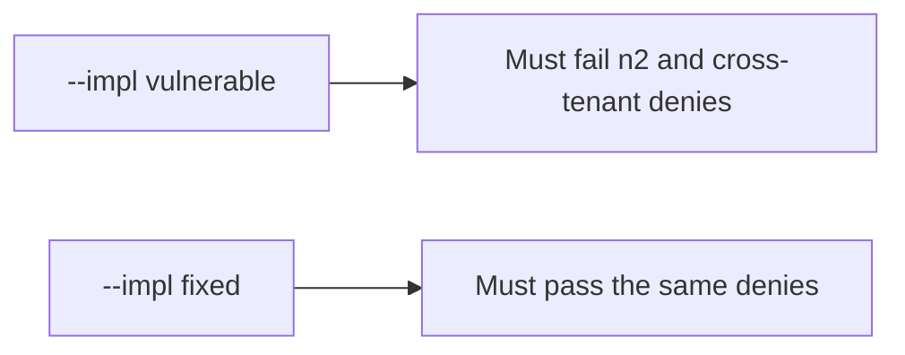

# 4.4-LO-05 — Evidence is deny on n2 and clinic, then a passing pair

**Kind:** verification-lab
**Loop step:** 5 Verify
**Standards:** OWASP ASVS 5.0.0 (final) `v5.0.0-8.2.2` and `v5.0.0-8.4.1`.

## An invariant that cannot fail a test is still a slogan

“We have RBAC” is not evidence. “IDs are UUIDs” is a mechanism observation. The oracle is: `can_read("bob", "n2") is False`. That observation must be **false** on `--impl vulnerable` (returns true) and **true** on `--impl fixed`.

## Mental model: vulnerable must fail: n2 and cross-tenant denies

The failing observation on `--impl vulnerable` is **n2 and cross-tenant denies**. A passing collection count is not this cell.



| Mode | Must show for this module |
|---|---|
| Normal | bob×n1 and alice×n2 are true (honest path; may pass on both) |
| Negative / abuse | bob×n2, alice×n3, eve×n1, eve×n3 are false; vulnerable must fail |
| Not claimed | Title vs body (7.2); search index; worker; RLS |

Lab tests in `labs/4.4/4.4-lab/tests/test_property.py`. `test_grant_on_n1_is_not_grant_on_n2` is a **forbidden-outcome** test: an ambient grant is not allowed to count as a passing control.

```text
python3 -m pytest labs/4.4/4.4-lab/tests --impl vulnerable
python3 -m pytest labs/4.4/4.4-lab/tests --impl fixed
```

Honest-path tests may pass on both implementations. That does not excuse the deny tests. If vulnerable does not fail bob×n2, the lab is miswired—fix the wiring, not the assertion.

## What the tests do not prove

- Field-level body vs title (7.2 / `v5.0.0-8.2.3`)
- Immediate grant revocation (`v5.0.0-8.3.2` Level 3 advanced)
- Worker originating subject (`v5.0.0-8.3.3` Level 3 advanced)
- Database role (3.3) or RLS (5.5)

Record those as residuals or later modules, not as silent passes.

## Practice

Execute both implementations this session. Write the fail/pass pair next to the matrix row. Reject a “test” that only greps `admin` in a role enum without calling `can_read("bob", "n2")`.

## Transfer

Clinic appointment vs chart. A test that only asserts HTTP 200 is not authorization evidence (see 9.3). A test that hits a live EHR is out of scope.

## Non-goals

Do not add a live enumerator. Do not log note bodies. Keys stay out of this file.
