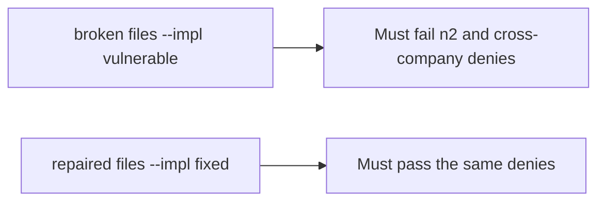

# The broken files must fail the n2 and cross-company denies

**Kind:** verification-lab
**Loop step:** 5 Verify

## Check it

Having roles in a table does not decide who may read. “Ids are hard to guess” is a hope. `can_read("bob", "n2")` has to be False. Leftover: Bob can still read n2. Repair returns false.

## Picture: broken must fail the n2 and cross-company denies

A check that only counts how many grants exist can still hide that leftover permission still opens n2.



| Mode | Must show for this topic |
|---|---|
| Normal | bob×n1 and alice×n2 are true (honest path; may pass on both) |
| Wrong input / abuse | bob×n2, alice×n3, eve×n1, eve×n3 are false; broken files must fail |
| Not claimed | Title vs body; search index; worker; row-level rules |

`test_grant_on_n1_is_not_grant_on_n2` names leftover permission on n2 as the miss.

```text
python3 -m pytest labs/4.4/4.4-lab/tests --impl vulnerable
python3 -m pytest labs/4.4/4.4-lab/tests --impl fixed
```

Alice reading her own note is the honest path. Deny bob×n2. If the broken files do not fail bob×n2, the lab is miswired — fix the wiring, not the assertion. A setup error is not proof the rule holds.

## What the tests do not prove

- Field-level body vs title (later topic)
- Immediate grant take-back (advanced)
- Worker originating person (advanced)
- Database role (earlier second gate) or row-level rules (later)

## Practice

Call `can_read("bob", "n2")`. An `admin` string in a role list is a label, not the read.

## Use it somewhere new

HTTP 200 on a chart read is not who-is-allowed evidence. Do not run a test that hits a live clinic system.

## What this page is not doing

Do not add a live id guesser. Do not log note bodies. Answer keys are not on this site.
