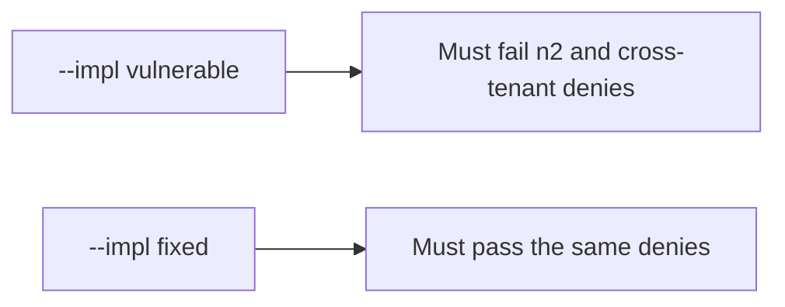

# 4.4-LO-05 — Evidence is deny on n2 and clinic, then a passing pair

**Kind:** verification-lab
**Loop step:** 5 Verify
**Standards:** OWASP ASVS 5.0.0 (final) `v5.0.0-8.2.2` and `v5.0.0-8.4.1`.

## An invariant that cannot fail a test is still a slogan

“We have RBAC” is not evidence. The oracle is the local pair.

## Mental model: fail-on-vulnerable, pass-on-fixed



| Case | Must show |
|---|---|
| Negative / abuse | bob×n2, alice×n3, eve×n1, eve×n3 are false |
| Normal | bob×n1 and alice×n2 are true |
| Not claimed | Title vs body (7.2); search index; worker; RLS |

Lab tests in `labs/4.4/4.4-lab/tests/test_property.py`:

```
python3 -m pytest labs/4.4/4.4-lab/tests --impl vulnerable
python3 -m pytest labs/4.4/4.4-lab/tests --impl fixed
```

Honest-path tests may pass on both implementations. That does not excuse the deny tests.

## What the tests do not prove

- Field-level body vs title (7.2 / `v5.0.0-8.2.3`)
- Immediate grant revocation (`v5.0.0-8.3.2` Level 3 advanced)
- Worker originating subject (`v5.0.0-8.3.3` Level 3 advanced)
- Database role (3.3) or RLS (5.5)

## Practice

Execute both implementations. Map each test to an LO-02 cell.

## Transfer

Clinic appointment vs chart. A test that only asserts HTTP 200 is not authorization evidence (see 9.3).
