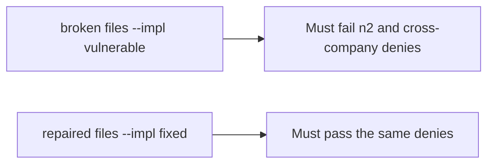

# The broken files must fail the n2 and cross-company denies

**Kind:** verification-lab
**Loop step:** 5 Verify

## Until you can fail it, it is still a slogan

“We have roles” is not evidence. “Ids are hard to guess” is a tool observation. The check is: `can_read("bob", "n2") is False`. That observation must be **false** on the broken files (returns true) and **true** on the repaired files.

## Picture: broken must fail the n2 and cross-company denies

A check that only counts how many grants exist can still look green while leftover permission still opens n2. The broken files have to fail that case. The repaired files have to pass it.



| Mode | Must show for this topic |
|---|---|
| Normal | bob×n1 and alice×n2 are true (honest path; may pass on both) |
| Wrong input / abuse | bob×n2, alice×n3, eve×n1, eve×n3 are false; broken files must fail |
| Not claimed | Title vs body; search index; worker; row-level rules |

The file is `labs/4.4/4.4-lab/tests/test_property.py`. `test_grant_on_n1_is_not_grant_on_n2` exists so leftover permission cannot count as a pass.

```text
python3 -m pytest labs/4.4/4.4-lab/tests --impl vulnerable
python3 -m pytest labs/4.4/4.4-lab/tests --impl fixed
```

Honest-path tests may pass on both implementations. That does not excuse the deny tests. If the broken files do not fail bob×n2, the lab is miswired — fix the wiring, not the assertion. A setup error is not proof the rule holds.

## What the tests do not prove

- Field-level body vs title (later topic)
- Immediate grant take-back (advanced)
- Worker originating person (advanced)
- Database role (earlier second gate) or row-level rules (later)

Record those as leftover or later topics, not as silent passes.

## Practice

Run both this session:

```text
python3 -m pytest labs/4.4/4.4-lab/tests --impl vulnerable
python3 -m pytest labs/4.4/4.4-lab/tests --impl fixed
```

Write the fail/pass pair next to the table row. Reject a “test” that only greps `admin` in a role list without calling `can_read("bob", "n2")`.

## Use it somewhere new

Clinic appointment vs chart. A test that only asserts HTTP 200 is not who-is-allowed evidence. A test that hits a live clinic system is out of scope.

## What this page is not doing

Do not add a live id guesser. Do not log note bodies. Answer keys are not on this site.
