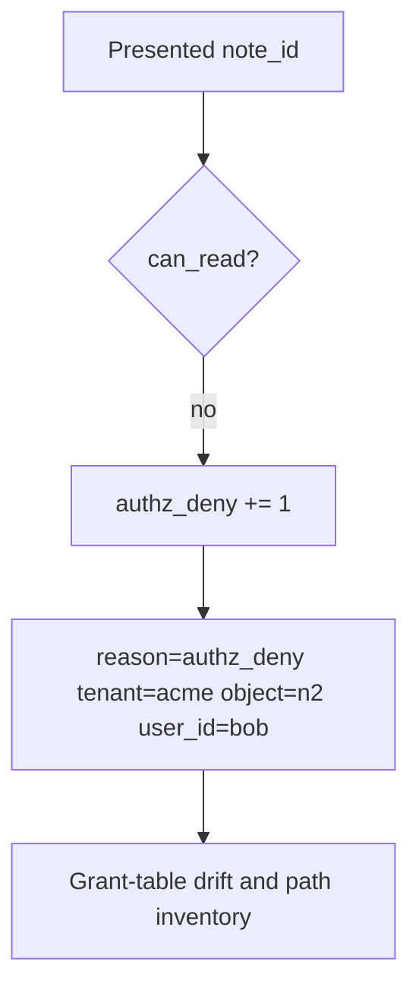

# Notice a deny; audit without logging bodies

**Kind:** operations-exercise
**Loop step:** 6 Operate

## Stopping it is not enough

A missed GraphQL path, a stale grant, or a worker can still release n2 after `can_read` was “fixed once.” Pair notice and recover. Do not log note bodies. Do not paste a personal email into the ticket.

## Picture: a deny is a signal, not a page footer



| Outcome | This topic |
|---|---|
| Notice | `authz_deny`; `grant_table_drift` |
| What the line holds | user id, object id, company, request id; never the body |
| Recover | Take back leftover flags; re-run the table on search/export |
| Leftover | An honest grant on n1 still reveals n1 |

Industry lists name detect, respond, recover. They do not key the grant. They do not prove the data-item check. A log-product name is not the rule. Re-run `test_grant_on_n1_is_not_grant_on_n2` after any path change; a green “roles enabled” tile is not that pytest. Search, export, and GraphQL `node(id)` are other paths of the same cell — inventory them before you claim recover.

## What the framework does vs what you still have to check

A network filter will page on 403 rate and stay silent when search still returns n2. Notice must observe **object-keyed deny**, not HTTP status counts. If the alert includes a note body, you have opened a logging cell from an earlier topic.

## Can people still use it

If a human sees “access denied,” announce it in text a screen reader can speak. A silent blank page pushes people to share passwords.

## Practice

Write one log line you would accept. Tie it to `labs/4.4/4.4-lab`.

```text
log_denied reason=authz_deny tenant=acme object_id=n2 user_id=bob request_id=req_44ac
```

Reject any line that includes a note body, a personal email, or “IDOR handled.”

## Use it somewhere new

Clinic: notice chart-id swaps; do not paste the chart into the ticket. Do not hit a live clinic system.

## What this page is not doing

A log-product name is not the rule. Live company dumps are out of scope. This site does not mark you as finished. Answer keys are not on this site.
