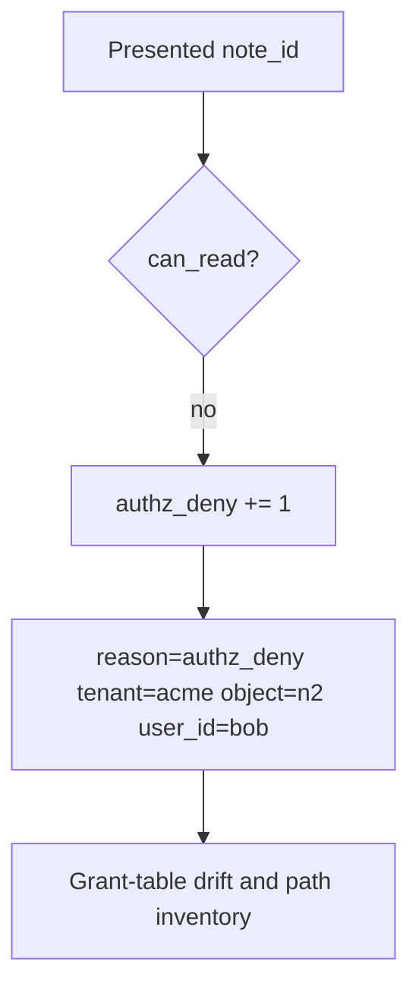

# 4.4-LO-06 — Detect authz_deny; audit without logging bodies

**Kind:** operations-exercise
**Loop step:** 6 Operate
**Standards:** NIST CSF 2.0 (final) DE/RS/RC as outcome labels; OWASP ASVS 5.0.0 (final) `v5.0.0-8.4.1`.

## Prevention is not absolute

A missed GraphQL path, a stale grant, or a worker can still release n2. Pair detect and recover. Do not log note bodies (3.1).

## Mental model: deny is a signal, not a page footer



| Outcome | This module |
|---|---|
| Detect | `authz_deny`; `grant_table_drift` |
| Signal | user id, object id, tenant, request id; never the body |
| Recover | Revoke ambient flags; re-run the matrix on search/export |
| Residual | Honest grant on n1 still reveals n1 |

## Practice

Write one log line you would accept. Tie it to `labs/4.4/4.4-lab`.

```
log_denied reason=authz_deny tenant=acme object_id=n2 user_id=bob request_id=req_44ac
```

Reject any line that includes a note body or a personal email.

## Transfer

Clinic: detect chart-id swaps; do not paste the chart into the ticket.

## Non-goals

SIEM product names are not the property.
