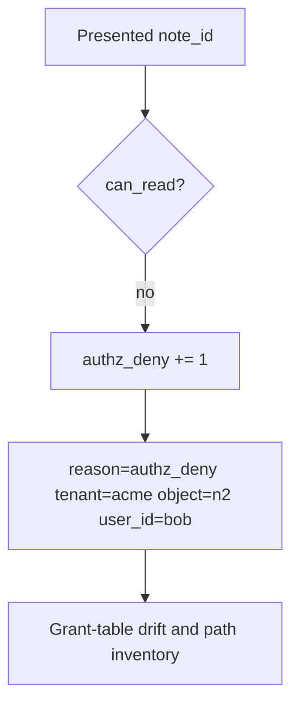

# 4.4-LO-06 — Detect authz_deny; audit without logging bodies

**Kind:** operations-exercise
**Loop step:** 6 Operate
**Standards:** NIST CSF 2.0 (final) DE/RS/RC as outcome labels; OWASP ASVS 5.0.0 (final) `v5.0.0-8.4.1`. CSF names outcomes; it does not key the grant.

## Prevention is not absolute

A missed GraphQL path, a stale grant, or a worker can still release n2 after `can_read` was “fixed once.” Pair detect and recover. Do not log note bodies (3.1). Do not paste a personal email into the ticket.

## Mental model: deny is a signal, not a page footer



| Outcome | This module |
|---|---|
| Detect | `authz_deny`; `grant_table_drift` |
| Signal | user id, object id, tenant, request id; never the body |
| Recover | Revoke ambient flags; re-run the matrix on search/export |
| Residual | Honest grant on n1 still reveals n1 |

CSF 2.0 Detect / Respond / Recover name outcomes. They do not prove `v5.0.0-8.2.2`. A SIEM product name is not the property. Re-run `test_grant_on_n1_is_not_grant_on_n2` after any path change; a green “RBAC enabled” tile is not that pytest. Search, export, and GraphQL `node(id)` are other paths of the same cell — inventory them before claiming Recover.

## Framework defaults versus the operate guarantee

A WAF will page on 403 rate and stay silent when search still returns n2. Detection must observe **object-keyed deny**, not HTTP status counts. If the alert includes a note body, you have opened a 3.1 cell.

## Practice

Write one log line you would accept. Tie it to `labs/4.4/4.4-lab`.

```text
log_denied reason=authz_deny tenant=acme object_id=n2 user_id=bob request_id=req_44ac
```

Reject any line that includes a note body, a personal email, or “IDOR handled.”

## Transfer

Clinic: detect chart-id swaps; do not paste the chart into the ticket. Do not hit a live EHR.

## Usability

If a human sees “access denied,” announce it (WCAG 2.2 Success Criterion 4.1.3). A silent blank page pushes people to share passwords (1.4).

## Non-goals

SIEM product names are not the property. Live tenant dumps are out of scope. Gates 0–10 stay not-attempted.
