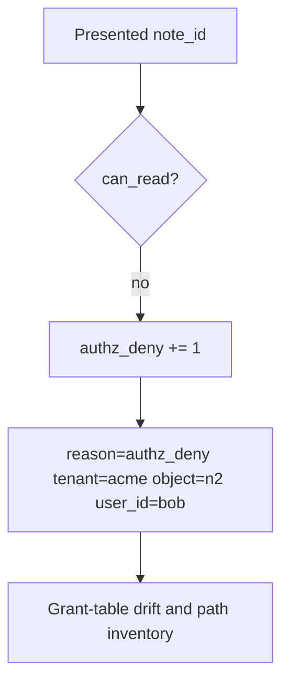

# Notice a deny; audit without logging bodies

**Kind:** operations-exercise
**Loop step:** 6 Operate

## Fixing it once is not enough

A missed GraphQL path, a stale grant, or a worker can still release n2. Skip personal emails and note bodies in the ticket.

## Picture: a deny is a signal, not a page footer



| Outcome | This topic |
|---|---|
| Notice | `authz_deny`; `grant_table_drift` |
| What the line holds | user id, object id, company, request id; never the body |
| Recover | Take back leftover flags; re-run the table on search/export |
| Leftover | An honest grant on n1 still reveals n1 |

A vendor name does not key the grant or prove the data-item check. Bob with only n1 still has to fail `test_grant_on_n1_is_not_grant_on_n2` on n2. Enabling roles does not keep n2 off bob's grant. Search, export, and GraphQL `node(id)` still treat an n1 grant as n2 unless those paths are keyed too.

## What the framework does vs what you still have to check

403-rate paging is silent on search still returning n2. Notice must observe **object-keyed deny**, not HTTP status counts. A note body on the object-keyed deny is a logging hole from an earlier topic.

## Can people still use it

If a human sees “access denied,” announce it in text a screen reader can speak. A silent blank page pushes people to share passwords.

## Practice

```text
log_denied reason=authz_deny tenant=acme object_id=n2 user_id=bob request_id=req_44ac
```

A note body, a personal email, or “IDOR handled” already spoils the log.

## Use it somewhere new

Notice chart-id swaps; do not paste the chart into the ticket. Do not hit a live clinic system.

## What this page is not doing

Do not use live company dumps. This site does not mark you as finished. Answer keys are not on this site.
