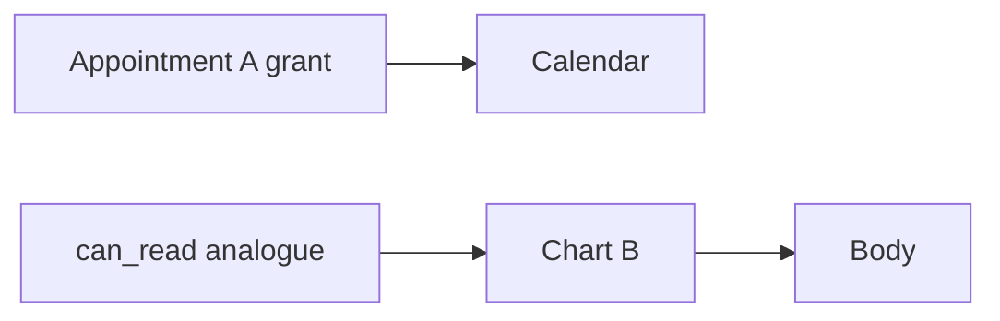

# 4.4-LO-07 — Transfer: appointment A is not chart B

**Kind:** transfer-challenge
**Loop step:** 7 Transfer
**Standards:** OWASP ASVS 5.0.0 (final) `v5.0.0-8.2.2` and `v5.0.0-8.4.1`; Saltzer complete mediation (1975, seminal).

## Change the workplace; keep object-keyed grants

Do not answer with a Top 10 / CWE / scanner as the definition of security. The SecureCollab sentence was: `can_read("bob", "n2")` is false. Rewrite it for a clinic without changing the fork.

**Prompt:** Clinic: grant on appointment A ≠ chart B.

**Product sketch:** EHR-lite with appointments, charts, and a tenant per clinic.

Rewrite the SecureCollab sentence. Include:

1. attacker capabilities (member with a real appointment grant who swaps chart id; clinic admin costume — **not** a live EHR);
2. trust assumptions (which lookup is TCB; the scheduling UI is not);
3. forbidden outcome (`can_read` true for chart B, not “HIPAA” and not “IDOR”);
4. a test idea on a **local** fixture only (appointment grant does not allow chart B);
5. residual (search index, export, worker, title-vs-body in 7.2);
6. WCAG 2.2 if a human-mediated “access denied” path is in the claim (usable deny, not a silent blank page that pushes people to share passwords).

## Mental model: two object classes, two grant tables

If the appointment grant feeds `can_read(chart)`, the cell is gone. FastAPI `Depends(get_user)` and a “clinician” role string do not key chart B. UUID length is obscurity, not a grant. A clinic admin costume that crosses tenants is the eve×n1 sibling: deny even if the role string says admin.

The clinic rewrite still has to keep the SecureCollab fork: a grant on appointment A is not a grant on chart B, and a grant in clinic-acme is not a grant in clinic-globex. Copying the share table into a new resource while leaving `has_any_share` as the gate leaves the new table unused. The local pytest analogue is `test_grant_on_n1_is_not_grant_on_n2` plus a cross-tenant deny — on a fixture, not a live EHR.

## What graders reject

| Reject | Why |
|---|---|
| “RBAC will isolate tenants” without a test | Role costume |
| Live clinic API | Lab policy |
| UUID length as the property | Obscurity |
| HTTP 200 as authorization evidence | Wrong observation |
| API1 as the definition | Awareness |

## Practice

One page. No keys. `labs/4.4/4.4-lab` is the only running system you may break. Do not enumerate a live EHR.

## Non-goals

Live-target id swaps. Real charts. Claiming Gate 4 from this page.
