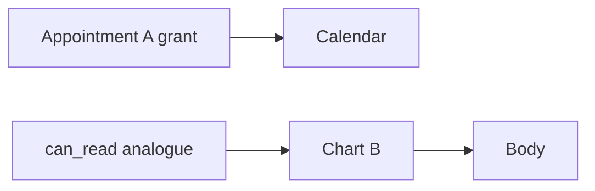

# Appointment A is not chart B

**Kind:** transfer-challenge
**Loop step:** 7 Transfer

## Use it somewhere new

You get a **clinic sketch** with appointments, charts, and a company per clinic.

On the notes app, `can_read("bob", "n2")` is false. For a clinic, a grant is keyed by person, company, and **this** object.

**Prompt:** Clinic: grant on appointment A ≠ chart B.

## Picture: two object classes, two grant tables

If the appointment grant feeds `can_read(chart)`, the rule is gone. FastAPI `Depends(get_user)` and a “clinician” role string do not key chart B. Id length is obscurity, not a grant. A clinic admin costume that crosses companies is the eve×n1 sibling: deny even if the role string says admin.

A grant on appointment A is not a grant on chart B, and a grant in clinic-acme is not a grant in clinic-globex. Copying the share table into a new resource while leaving `has_any_share` as the gate leaves the new table unused. That leftover permission is the same cause with new nouns. The local check is `test_grant_on_n1_is_not_grant_on_n2` plus a cross-company deny — on a practice, not a live clinic system.

## Prompt — clinic sketch

1. who can act (member with a real appointment grant who swaps chart id; clinic admin costume — **not** a live clinic system);
2. what you trust (which lookup is trusted; the scheduling UI is not);
3. what must not happen (`can_read` true for chart B, not a legal label and not “IDOR”);
4. a test idea on a **local** practice files only (appointment grant does not allow chart B);
5. leftover (search index, export, worker, title-vs-body later);
6. whether a human-seen “access denied” path must be announced in text, not a silent blank page that pushes people to share passwords.

## What is not good enough

| Reject | Why |
|---|---|
| “Roles will isolate companies” without a test | Role costume |
| Live clinic API | Course rules |
| Id length as the rule | Obscurity |
| HTTP 200 as who-is-allowed evidence | Wrong observation |
| A famous-bugs code as the definition | Awareness |

## Practice

One page. No answer keys. `labs/4.4/4.4-lab` is the only running system you may break. Do not guess ids on a live clinic system.

## What this page is not doing

Live-target id swaps. Real charts. Claiming a course gate from this page.
