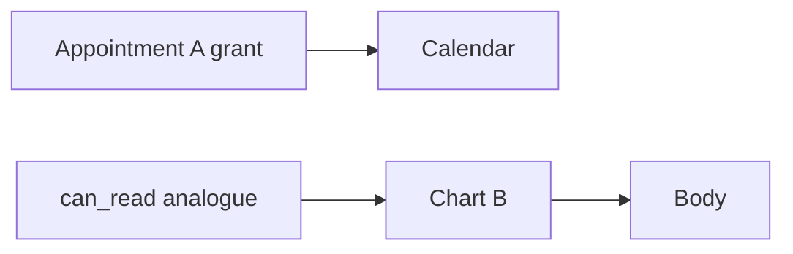

# 4.4-LO-07 — Transfer: appointment A is not chart B

**Kind:** transfer-challenge
**Loop step:** 7 Transfer
**Standards:** OWASP ASVS 5.0.0 (final) `v5.0.0-8.2.2` and `v5.0.0-8.4.1`; Saltzer complete mediation (1975, seminal).

## Change the workplace; keep object-keyed grants

Do not answer with a Top 10 / CWE / scanner as the definition of security.

**Prompt:** Clinic: grant on appointment A ≠ chart B.

**Product sketch:** EHR-lite with appointments, charts, and a tenant per clinic.

Rewrite the SecureCollab sentence. Include:

1. attacker capabilities (member with a real appointment grant who swaps chart id; clinic admin costume — not a live EHR);
2. trust assumptions (which lookup is TCB; the scheduling UI is not);
3. forbidden outcome (`can_read` true for chart B, not “HIPAA”);
4. a test idea on a **local** fixture only;
5. residual (search index, export, worker, title-vs-body in 7.2);
6. WCAG 2.2 if a human-mediated “access denied” path is in the claim (usable deny, not a silent blank page that pushes people to share passwords).

## Mental model: two object classes, two grant tables

If the appointment grant feeds `can_read(chart)`, the cell is gone.

## What graders reject

| Reject | Why |
|---|---|
| “RBAC will isolate tenants” without a test | Role costume |
| Live clinic API | Lab policy |
| UUID length as the property | Obscurity |

## Practice

One page. No keys. `labs/4.4/4.4-lab` is the only running system you may break.
