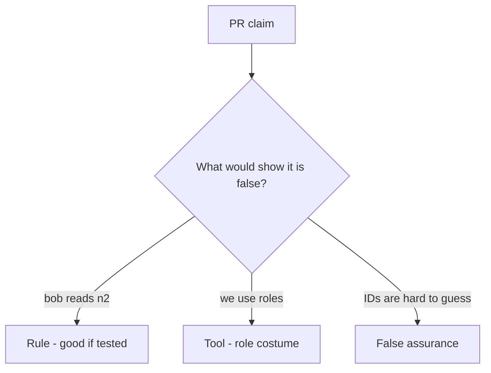

# Review of leftover grants

**Kind:** code-review
**Loop step:** Review

## What you are reviewing

This is a who-is-allowed review. Does `can_read("bob", "n2")` still return true?

Shipping “will add object checks later” leaves `test_grant_on_n1_is_not_grant_on_n2` failing.

## Picture: if user.has_any_share: return note

**`if user.has_any_share: return note`**.

n2 still has to be denied for Bob. A grant on n1 that is not keyed by object still opens n2. A role list named `admin` without a company comparison is the eve×n1 example.

Leftover permission is permission from the surroundings — a signed-in user, “has any share,” an unscoped admin flag — used as if it were a yes for this person, this note, and this action.

## Problems to find (name them yourself)

- `if user.has_any_share: return note`
- Missing n2 deny test
- Admin boolean bypass without company
- Search endpoint without a check

Also reject: trusting the client; closing findings without re-running `test_grant_on_n1_is_not_grant_on_n2`; keys in lessons; real people's data in the practice files; “IDOR” as the requirement.

## Common mix-ups

- A scanner “IDOR” name is the missing rule
- A role replaces object grants
- Signed ids are capabilities
- `Depends(get_user)` is who-is-allowed
- Id length is the grant

## Use it somewhere new

Checking “is a clinician” without keying the chart still leaves leftover permission. What still has to key the object so Bob cannot read n2 with an n1 grant?

## What this page is not doing

Object checks promised for later still need a named owner before merge. Do not guess ids on a live API to prove the finding.
