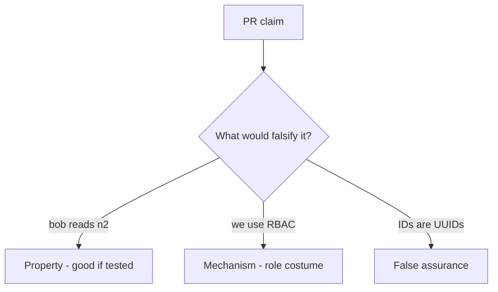

# 4.4-LO-08 — Review ambient grants as a PR, not an IDOR ticket

**Kind:** code-review
**Loop step:** Review
**Standards:** OWASP ASVS 5.0.0 (final) `v5.0.0-8.2.2` and `v5.0.0-8.4.1`.

## Review the fixture as if it were SecureCollab authorization

Review `labs/4.4/4.4-lab/vulnerable/` as a SecureCollab PR. Your job is not to count suspicious lines. Reconstruct whether `can_read("bob", "n2")` is still true, compare that with the module invariant, and write changes a developer can verify.

Intended findings live only in `content/assessment/keys/4.4.md` — not here. Do not open the keys file until your review has been evaluated.

## Mental model: if user.has_any_share: return note

Start with this seeded smell: **`if user.has_any_share: return note`**. Label it property, mechanism, or false assurance before you accept the PR.

Classification starts at the protected effect (n2 denied for bob). Everything that is not an object-keyed lookup at that call is a candidate ambient path. A role enum named `admin` without a tenant comparison is the eve×n1 smell, not a different finding class.

## Seeded smells (label them yourself)

- `if user.has_any_share: return note`
- Missing n2 deny test
- Admin boolean bypass without tenant
- Search endpoint without mediation

Also reject: client trust; closing findings without re-running `test_grant_on_n1_is_not_grant_on_n2`; keys in lessons; real PII in fixtures; “IDOR” as the requirement.

## Misconceptions this module refuses

- IDOR is a scanner finding not a missing cell
- RBAC role replaces object grants
- Signed ids are capabilities
- `Depends(get_user)` is authorization
- UUID length is the grant

## Practice

Write three review notes a maintainer could act on. Each note: observation, property or false assurance, suggested structural change, residual you will **not** delete. Tie at least one to `test_grant_on_n1_is_not_grant_on_n2`.

## Transfer

Clinic PR that “checks the user is a clinician” without keying the chart is an incomplete mediation review. Name the independent falsehood that would still keep bob from reading n2.

## Non-goals

Do not merge by adding a comment “will add object checks later.” That comment is a residual without an owner. Do not enumerate a live API to prove the finding.
