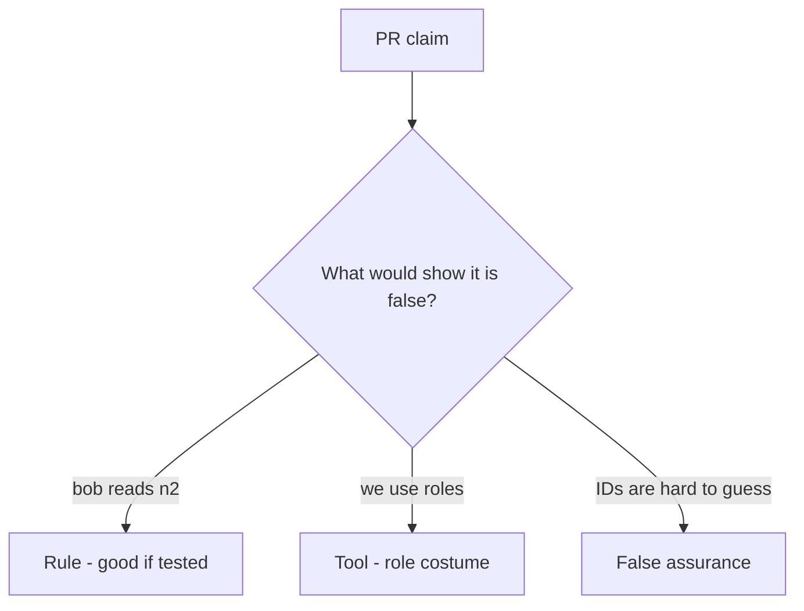

# Review of leftover grants

**Kind:** code-review
**Loop step:** Review

## What you are reviewing

This review is about notes-app who-is-allowed. Check whether `can_read("bob", "n2")` is still true.

A comment “will add object checks later” is not a pass on `test_grant_on_n1_is_not_grant_on_n2`.

## Picture: if user.has_any_share: return note

**`if user.has_any_share: return note`**.

n2 still has to be denied for Bob. If the change never uses an object-keyed lookup, that leftover path is still open. A role list named `admin` without a company comparison is the eve×n1 example.

Leftover permission is permission from the surroundings — a signed-in user, “has any share,” an unscoped admin flag — used as if it were a yes for this person, this note, and this action.

## Problems to find (name them yourself)

- `if user.has_any_share: return note`
- Missing n2 deny test
- Admin boolean bypass without company
- Search endpoint without a check

Also reject: trusting the client; closing findings without re-running `test_grant_on_n1_is_not_grant_on_n2`; keys in lessons; real people's data in the practice files; “IDOR” as the requirement.

## Common mix-ups

- A scanner “IDOR” name is the missing rule
- A role replaces object grants
- Signed ids are capabilities
- `Depends(get_user)` is who-is-allowed
- Id length is the grant

## Use it somewhere new

Clinic change that “checks the user is a clinician” without keying the chart is an incomplete review of leftover permission. Name the independent falsehood that would still keep Bob from reading n2.

## What this page is not doing

Do not merge by adding a comment “will add object checks later.” That comment is leftover without an owner. Do not guess ids on a live API to prove the finding.
