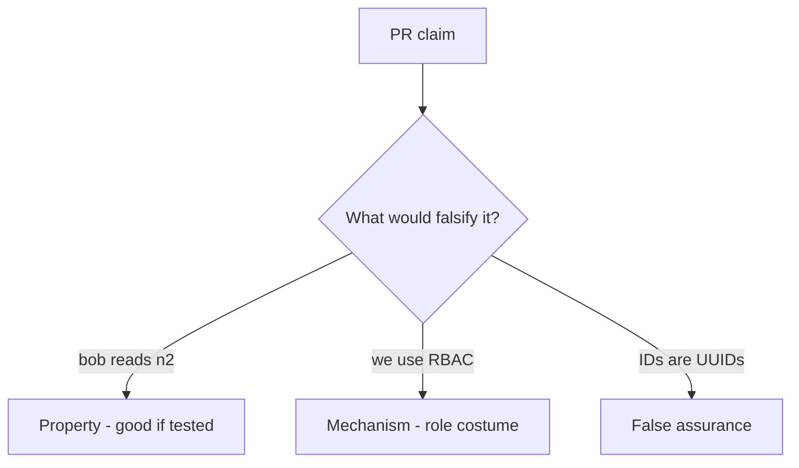

# 4.4-LO-08 — Review ambient grants as a PR, not an IDOR ticket

**Kind:** code-review
**Loop step:** Review
**Standards:** OWASP ASVS 5.0.0 (final) `v5.0.0-8.2.2` and `v5.0.0-8.4.1`.

## Review the fixture as if it were SecureCollab authorization

Review `labs/4.4/4.4-lab/vulnerable/` as a SecureCollab PR. Intended findings live only in `content/assessment/keys/4.4.md` — not here.

## Mental model: if user.has_any_share: return note

Start with this seeded smell: **`if user.has_any_share: return note`**. Label it property, mechanism, or false assurance before you accept the PR.

Seeded smells (label them yourself; do not open the keys file):

- `if user.has_any_share: return note`
- Missing n2 deny test
- Admin boolean bypass without tenant
- Search endpoint without mediation

Also reject: client trust, closing findings without retest, keys in lessons, real PII in fixtures.

## Misconceptions

- IDOR is a scanner finding not a missing cell
- RBAC role replaces object grants
- Signed ids are capabilities

## Practice

Write three review notes. Tie at least one to `test_grant_on_n1_is_not_grant_on_n2`.

## Transfer

Clinic PR that “checks the user is a clinician” without keying the chart is incomplete.
