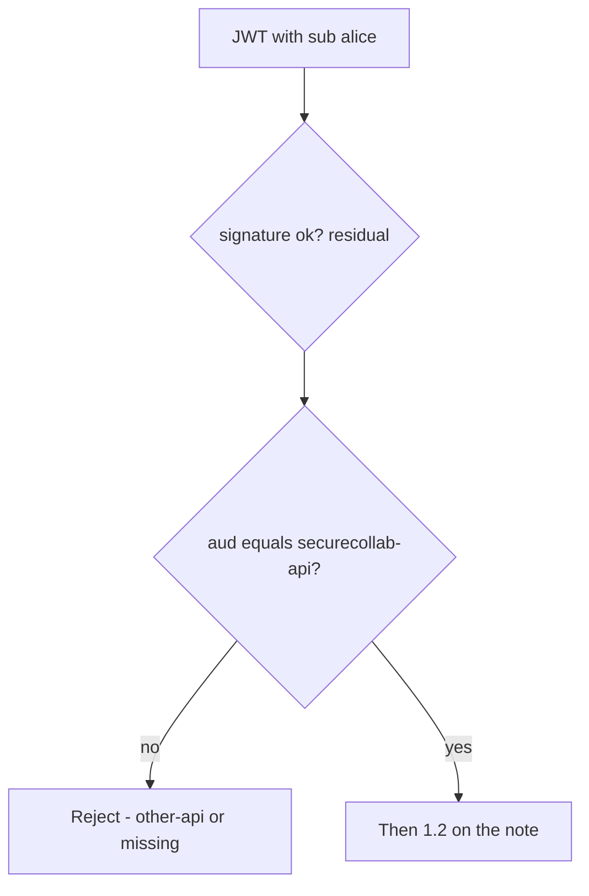
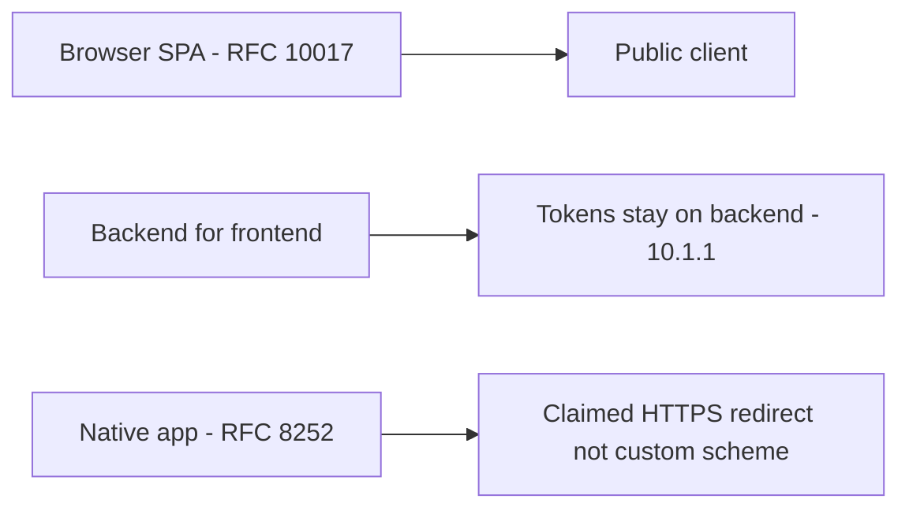

# 4.5-LO-01 — A token for other-api is not a SecureCollab session

**Kind:** concept-model
**Loop step:** 1 Property
**Standards:** IETF RFC 9700 / BCP 240 (final) OAuth 2.0 security; IETF RFC 10017 / BCP 212 (final, August 2026) browser-based apps; IETF RFC 8252 (final) native apps; OWASP ASVS 5.0.0 (final) `v5.0.0-10.3.1`, `v5.0.0-10.1.1`, `v5.0.0-10.2.1`; `v5.0.0-10.3.5` is **Level 3, advanced**. OAuth 2.1 is an **Internet-Draft**. JWT *aud* is this lab’s cell, not “we use OAuth.”

## The claim this module owns

SecureCollab Phase 1 will accept delegated access tokens at `securecollab-api`. Delegation is not authentication theater: an access token is a capability *for a named audience*. A JWT with `sub=alice` and `aud=other-api` must not spend SecureCollab. An ID token’s `aud` is the *client_id* (`v5.0.0-10.5.4`); that is a different name. Authlib “verify signature” is not this sentence.

> `accept_token({"sub": "alice", "aud": "other-api"}, "securecollab-api")` must be false. Missing `aud` must be false. Expected `aud` may be true. PKCE, `state`, `nonce`, JWKS, `iss`, and DPoP are named residuals — they are not proven by this fixture. OAuth 2.1 remains draft.

The forbidden outcome is **JWT with wrong audience accepted as a SecureCollab session**. That is a 1.1 authenticity failure of the audience binding; 1.2 then runs as whoever `sub` names.

ASVS `v5.0.0-10.3.1` wants the resource server to accept only tokens intended for that service. `v5.0.0-10.1.1` wants tokens only in components that need them (BFF: the browser does not hold the access token). `v5.0.0-10.2.1` wants PKCE or `state` on the code flow. `v5.0.0-10.3.5` (sender-constrained tokens / DPoP / mTLS) is **Level 3 (advanced)**. RFC 9700 is the OAuth 2.0 security BCP. RFC 10017 is the browser-app BCP. RFC 8252 is native apps. Do not present OAuth 2.1 as final.

## Mental model: audience is a name, not a signature



The attacker holds a token minted for another API (confused deputy), or replays a stolen bearer. Trusting “it verified” without checking `aud` is not a TCB.

**Mechanism (not the property):** Auth0, Authlib, or “we enabled OIDC.”

## Mental model: three client shapes



This lab executes the resource-server `aud` check. Browser-token storage, mix-up, and native redirects are named holes.

## Root cause vs impact vs prevention vs detection vs recovery

| Slice | For this property |
|---|---|
| Root cause | Subject (or signature) accepted without audience |
| Preconditions | `accept_token` ignores `aud` |
| Trigger | Bearer minted for `other-api` |
| Impact | Authenticity of audience; then 1.2 as `sub` |
| Prevention | Exact `aud` match (or constrained list) before 1.2 |
| Detection | `jwt_aud_mismatch` |
| Recovery | Revoke client; rotate keys if tokens self-verify |

## Framework defaults versus the audience guarantee

Authlib and many JWTs libraries verify a signature if you configure a key and skip `aud`. Next.js middleware that “has a Bearer” is not `v5.0.0-10.3.1`. Oracle: `labs/4.5/4.5-lab`. No live IdP.

## Mechanism limits

- Correct `aud` still needs 1.2 on the note (4.4).
- Empty `aud`; array tricks; `alg=none` — reject unknown alg; do not treat this lesson as a payload catalogue.
- PKCE, `state`, `nonce`, `iss`, JWKS, sender-constraining remain out of the fixture.
- 4.1 leftover tokens after client deprovision.

## Practice

Name the expected audience and the wrong one. Then run:

```
python3 -m pytest labs/4.5/4.5-lab/tests --impl vulnerable
python3 -m pytest labs/4.5/4.5-lab/tests --impl fixed
```

The first command must fail on the deny tests. The second must pass.

## Transfer

Clinic: wrong-aud FHIR token. Mobile redirect (8.3, RFC 8252) and BFF vs SPA storage.

## Non-goals

Live IdPs, real patient tokens, weaponized `alg=none` copy-paste. Gates 0–10 and milestones M0–M5 stay **not-attempted** without learner or product evidence. Answer keys are not in this file.
