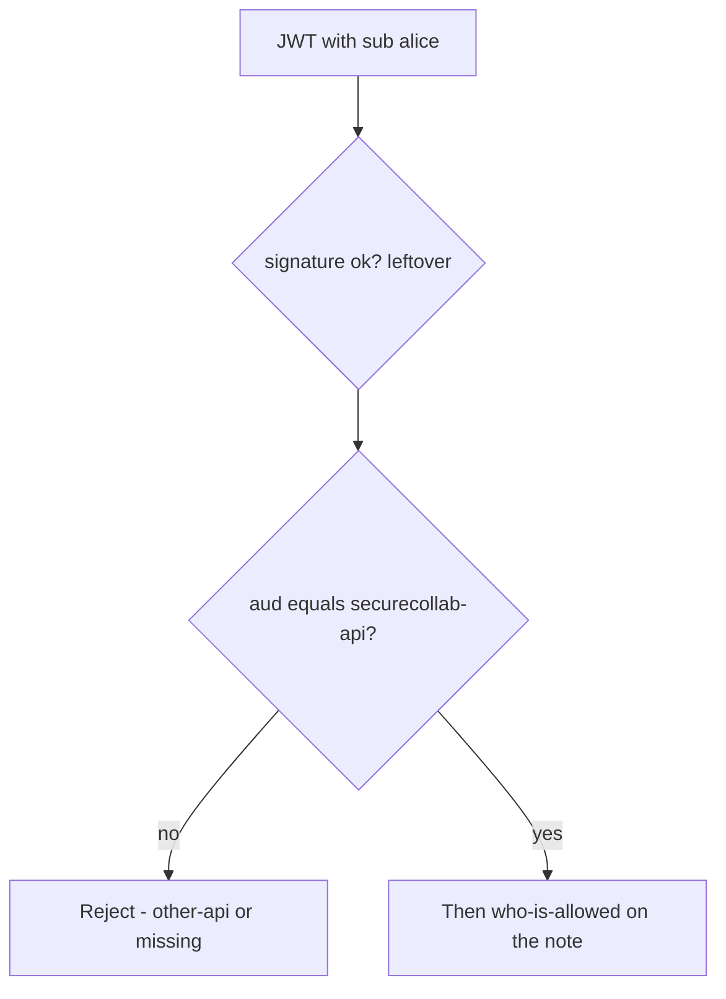
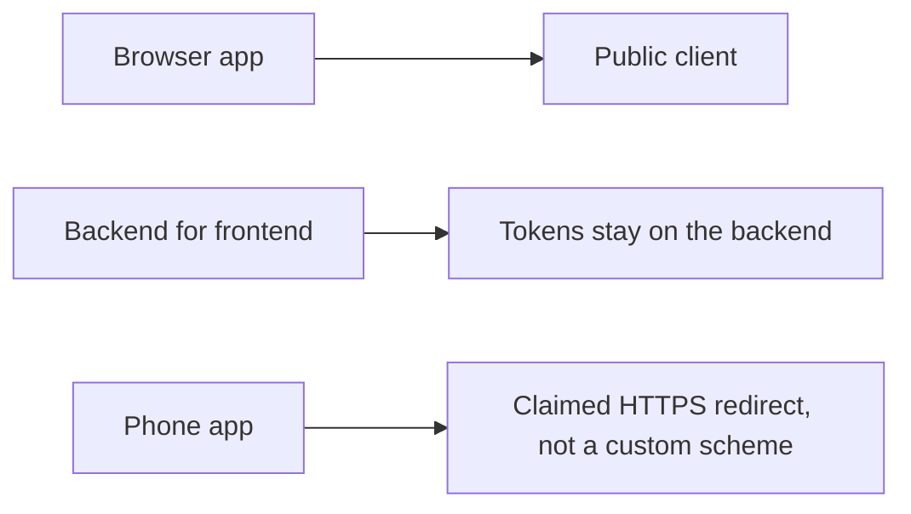

# A token for another API is not a notes-app login

**Kind:** concept-model
**Loop step:** 1 Property

## The rule

The notes app will later accept access tokens at its API. An access token is a capability **for a named audience**. A JWT that names `sub=alice` and `aud=other-api` must not spend the notes app. An ID token’s audience is the **client id** — that is a different name. A library that only checks the signature is not this sentence.

> `accept_token({"sub": "alice", "aud": "other-api"}, "securecollab-api")` must be false. Missing `aud` must be false. Expected `aud` may be true. PKCE, `state`, `nonce`, JWKS, `iss`, and DPoP are named leftovers — they are not proven by this practice. OAuth 2.1 is still a draft.

What must not happen is **a JWT with the wrong audience accepted as a notes-app session**. The token is treated as a login even though it was minted for someone else. Then who-is-allowed runs as whoever `sub` names.

Industry lists ask for the API to accept only tokens meant for that service. They want tokens only in components that need them (in a backend-for-frontend, the browser does not hold the access token). They want PKCE or `state` on the code flow. Sender-constrained tokens (DPoP / mutual TLS) are an advanced extra, not this week's check. RFC 9700 is the OAuth 2.0 security practice. RFC 10017 is the browser-app practice. RFC 8252 is native apps. Do not present OAuth 2.1 as final.

## Picture: audience is a name, not a signature



The attacker holds a token minted for another API (confused deputy), or replays a stolen bearer. Trusting “it verified” without checking `aud` is not what you trust.

**A tool is not the rule.** Auth0, Authlib, or “we turned on OpenID Connect.”

## Picture: three client shapes



This practice runs the resource-server `aud` check. Where the browser stores tokens, mix-up attacks, and native redirects are named holes.

## Why it happens, what it costs, how you stop it, how you notice, how you recover

| Slice | For this rule |
|---|---|
| Why it happens | Subject (or signature) accepted without audience |
| What has to be true first | `accept_token` ignores `aud` |
| Trigger | Bearer minted for `other-api` |
| What it costs | Authenticity of the audience; then who-is-allowed as `sub` |
| How you stop it | Exact `aud` match (or a constrained list) before who-is-allowed |
| How you notice | `jwt_aud_mismatch` |
| How you recover | Revoke the client; rotate keys if tokens self-verify |

## What the framework does vs what you still have to check

Authlib and many JWT libraries will check a signature if you give them a key and skip `aud`. Next.js middleware that “has a Bearer” is not an audience check. The app’s promise is: `labs/4.5/4.5-lab`. No live identity provider.

## What the tool cannot do

- Correct `aud` still needs who-is-allowed on the note.
- Empty `aud`; array tricks; `alg=none` — reject unknown algorithms; this page is not a payload catalogue.
- PKCE, `state`, `nonce`, `iss`, JWKS, and sender-constraining stay out of this practice.
- Leftover tokens after a client is removed.

## Practice

Name the expected audience and the wrong one. Then run:

```text
python3 -m pytest labs/4.5/4.5-lab/tests --impl vulnerable
python3 -m pytest labs/4.5/4.5-lab/tests --impl fixed
```

The first command must fail on the deny tests. The second must pass.

## Use it somewhere new

A clinic example: wrong-audience FHIR token. Phone-app redirect (claimed HTTPS, not a custom scheme) and backend-for-frontend vs browser token storage.

## What this page is not doing

Live identity providers, real patient tokens, weaponized `alg=none` copy-paste. This site does not mark you as finished. without product evidence. Answer keys are not on this site.
