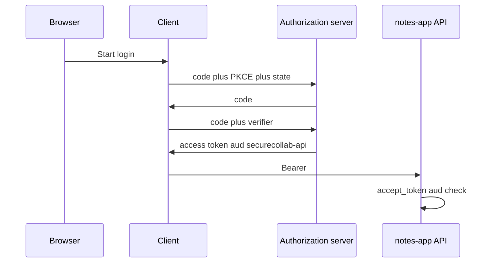
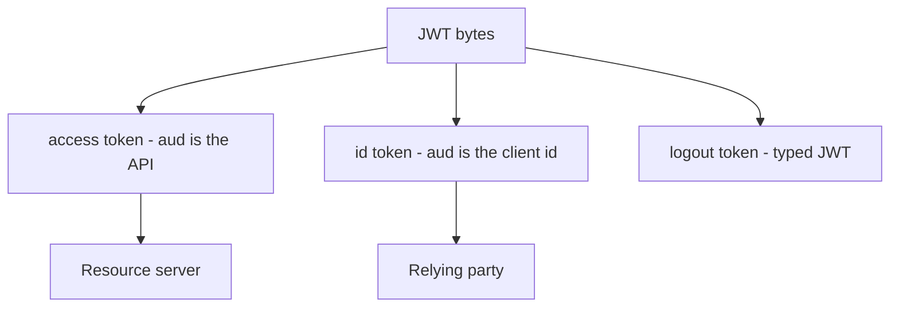

# A sequence someone else can test

**Kind:** design-exercise
**Loop step:** 2 Model

## Could someone else name the checks from your sequence?

“We use OAuth” is not this page. A reviewable model names **authorization server, client, resource server, audience, and which secrets bind the transaction**.

`accept_token` is local. Expected audience `securecollab-api` (the notes app’s API name in this practice). No live authorization server.

## Picture: code flow vs this practice’s one check

This practice implements only the last box. Missing PKCE, `state`, or `nonce` is a hole, not a pass.

## Picture: JWT is a format, not an architecture

An earlier topic already refused “JWT means secure.” Here the same format carries different audience names.

## Step 1: name who, what, and when

| Piece | This system |
|---|---|
| Who | alice; client; stolen-token attacker; other-api resource server |
| What | access token; expected aud `securecollab-api` |
| Actions | `accept_token` |
| Paths | Authorization header (not the query string) |
| What you trust | Resource-server audience check (later: iss, exp, signature, sender-constraint) |
| What you do not trust | Client-supplied token blob; “OpenID Connect is on” |
| State / time | Long-lived tokens after a client is removed |
| The rule | Authenticity of the audience binding |

## Step 2: write rows the lab can fail

| Who | What | Action | Decision |
|---|---|---|---|
| client | aud=securecollab-api | call API | allow-if-valid then who-is-allowed |
| client | aud=other-api | call API | deny |
| client | missing aud | call API | deny |
| browser | id_token | call API | deny (wrong token type) |
| phone app | custom-scheme token | store | leftover — claimed HTTPS redirect, not a custom scheme |

## Practice

In `labs/4.5/4.5-lab`, mark `jwt_aud.py`.

## Use it somewhere new

Phone app: claimed HTTPS redirect vs custom scheme. Backend-for-frontend vs browser token storage.

## What can still go wrong

PKCE, nonce, mix-up, DPoP (advanced sender-constraint).

## What this page is not doing

Do not treat a famous-bugs list as the definition of security. Answer keys are not on this site.
