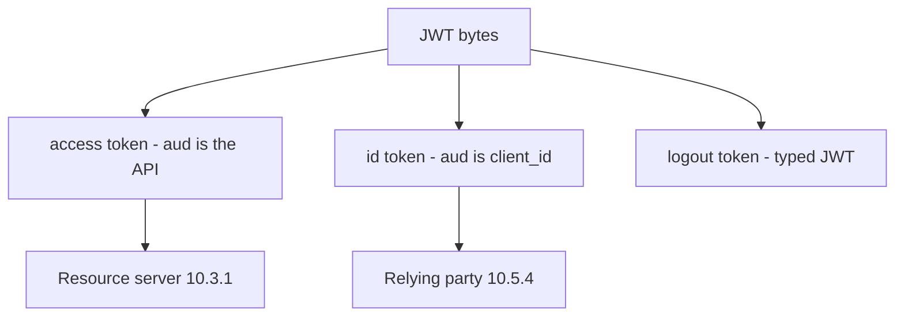

# 4.5-LO-02 — A sequence a second engineer can test

**Kind:** design-exercise
**Loop step:** 2 Model
**Standards:** RFC 9700 (final); RFC 10017 (final, August 2026); RFC 8252 (final); OWASP ASVS 5.0.0 (final) `v5.0.0-10.3.1` and `v5.0.0-10.2.1`.

## Can a second engineer name pytest cases from your sequence?

“We use OAuth” is not this lesson. A reviewable model names **authorization server, client, resource server, audience, and which secrets bind the transaction**.

SecureCollab Phase 1 freeze: local `accept_token`. Expected aud `securecollab-api`. No live AS.

## Mental model: code flow vs this lab’s one check

This lab implements only the last box. Missing PKCE/`state`/`nonce` is a hole (`v5.0.0-10.1.2`, `v5.0.0-10.2.1`), not a pass.

## Mental model: JWT is a format, not an architecture

Module 4.3 already refused “JWT means secure.” Here the same format carries different audience names.

## Step 1: freeze pieces

| Piece | This system |
|---|---|
| Subjects | alice; client; stolen-token attacker; other-api RS |
| Objects | access token; expected aud `securecollab-api` |
| Actions | `accept_token` |
| Channels | Authorization header (not query string — 4.3) |
| TCB | RS audience check (later iss, exp, signature, sender-constraint) |
| Untrusted | Client-supplied token blob; “OIDC is on” |
| State / time | Long-lived tokens after deprovision (4.1) |
| 1.1 cell | Authenticity of the audience binding |

## Step 2: write cells

| Subject | Object | Action | Decision |
|---|---|---|---|
| client | aud=securecollab-api | call API | allow-if-valid then 1.2 |
| client | aud=other-api | call API | deny |
| client | missing aud | call API | deny |
| browser | id_token | call API | deny (wrong token type) |
| mobile | custom-scheme token | store | 8.3 / RFC 8252 residual |

## Practice

Draw this map so a second engineer could name pytest cases. Point at `labs/4.5/4.5-lab` file `jwt_aud.py`.

## Transfer

Mobile claimed HTTPS redirect vs custom scheme. BFF vs SPA token storage (`v5.0.0-10.1.1`).

## Residual risk

PKCE, nonce, mix-up (`v5.0.0-10.2.2`), DPoP (`v5.0.0-10.3.5` Level 3 advanced).

## Non-goals

Top 10 as the definition of security. Keys stay out of lessons.
