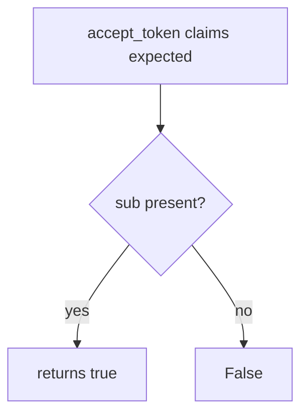

# 4.5-LO-03 — Observe the skipped audience, do not trophy a JWT

**Kind:** mechanism-lab
**Loop step:** 3 Break
**Standards:** OWASP ASVS 5.0.0 (final) `v5.0.0-10.3.1`; RFC 9700 (final).

## Authorized scope

`labs/4.5/4.5-lab` only. Synthetic claims. No live IdPs.

**Forbidden outcome:** JWT with wrong audience accepted as a SecureCollab session.

## Mental model: sub without aud



The vulnerable tree demonstrates **cause** (audience never consulted), not a trophy dump of a production access token.

## What to read in the fixture

`vulnerable/jwt_aud.py` `accept_token` returns true when `sub` is in the dict. Tests require `aud=other-api` and missing `aud` to stay false, and expected `aud` to stay true.

## Root cause vs impact

| Slice | Lab |
|---|---|
| Root cause | Subject accepted without audience |
| Impact | other-api token spends SecureCollab API |
| Not the lesson | An OAuth product name as the definition |

## Practice

```
python3 -m pytest labs/4.5/4.5-lab/tests --impl vulnerable
```

Record `test_wrong_audience_is_rejected`. Do not weaken it to “the JWT verifies.”

## Transfer

Clinic: FHIR token minted for another hospital’s API. Predict without leaving this directory.

## Non-goals

No live-target instructions. Synthetic data only.
