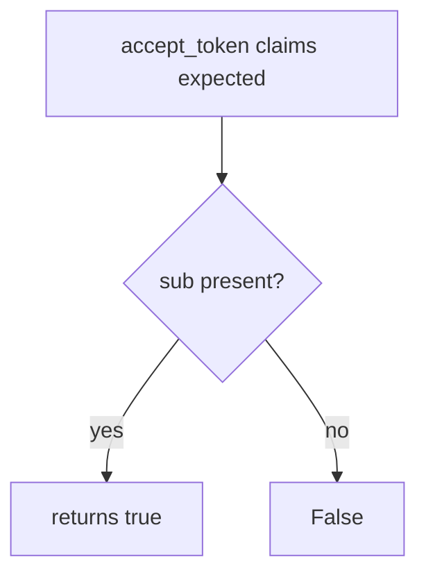

# Practice: a JWT with the wrong audience is accepted

**Kind:** mechanism-lab
**Loop step:** 3 Break

## Try it

The practice is not a website you attack. `accept_token` uses fake claims. It does not open an identity provider or check a real signature. A JWT minted for another API still counting as a notes-app session is the break; you do not need a production token.

> A token for another API is not a notes-app session. `accept_token({"sub": "alice", "aud": "other-api"}, "securecollab-api")` must be false.

## Where you may practice

Stay inside `labs/4.5/4.5-lab`. Restore the broken and repaired folders when you are done. Fake claims only.

Do not replay a production access token, an employer OpenID tenant, or a classmate Auth0 app.

`accept_token({"sub": "alice", "aud": "other-api"}, "securecollab-api")` true is a wrong-audience JWT treated as a notes-app session.

Picture a **bearer minted for another API** (confused deputy), or a stolen token whose `sub` looks familiar. The **resource server compares `aud` to itself** before who-is-allowed — not Authlib “verify signature,” Auth0, or “we turned on OpenID Connect”.

## Picture: sub without aud



Audience is never consulted — not a dump of a production access token. `accept_token` returns true when `sub` is in the dict. You do not need a signed JWT. You must not paste a live one.

A library saying the signature is fine is not `accept_token` with a foreign audience.

## What to look at: the cause, not a hunt

In `vulnerable/jwt_aud.py`, `accept_token` returns true when `sub` is in the dict. Checks:

- `test_wrong_audience_is_rejected`
- `test_missing_audience_is_rejected`
- `test_expected_audience_is_accepted` — honest path (may pass on both)

## Why it happens, what it costs, how you stop it, how you notice, how you recover

| Slice | This practice |
|---|---|
| The rule | Token for `other-api` is not a notes-app session |
| Why it happens | Subject (or signature) accepted without audience |
| What's already wrong | `accept_token` ignores `aud` |
| Trigger | Bearer minted for `other-api` |
| What it costs | Authenticity of the audience; then who-is-allowed as `sub` |
| How you stop it | Exact `aud` match (or a constrained list) before who-is-allowed |
| How you notice | `jwt_aud_mismatch` |
| How you recover | Revoke the client; rotate keys if tokens self-verify |
| Not the lesson | An OAuth product name, OAuth 2.1 as final, or “the JWT verifies” |

## What the framework does vs what you still have to check

Authlib and many JWT libraries will check a signature if you give them a key and skip `aud`. Next.js middleware that “has a Bearer” is not an audience check. Wrong `aud` → false.

## Practice

```text
python3 -m pytest labs/4.5/4.5-lab/tests --impl vulnerable
```

“The JWT verifies” is not `accept_token` with a foreign audience. A setup error is not proof the rule holds.

## Use it somewhere new

FHIR token minted for another hospital’s API. Predict without leaving this directory. Do not hit a live FHIR endpoint.

## What this page is not doing

No live-target token replay. Fake claims only. Do not ship `alg=none` payloads in this file.
