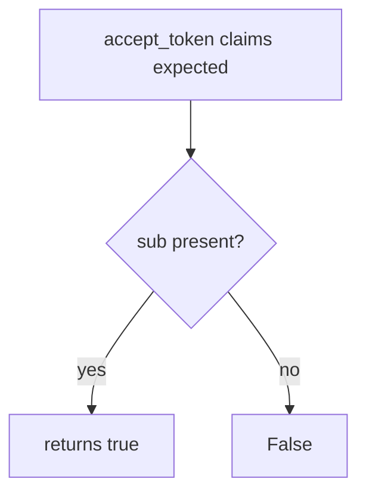

# 4.5-LO-03 — Observe the skipped audience, do not trophy a JWT

**Kind:** mechanism-lab
**Loop step:** 3 Break
**Standards:** OWASP ASVS 5.0.0 (final) `v5.0.0-10.3.1`; IETF RFC 9700 / BCP 240 (final). OAuth 2.1 remains an **Internet-Draft**.

## Authorized scope

`labs/4.5/4.5-lab` only. The fixture is an in-process `accept_token`. Synthetic claims. It does not open an IdP or verify a real signature. Do not replay a production access token, an employer OIDC tenant, or a classmate Auth0 app.

**Forbidden outcome:** JWT with wrong audience accepted as a SecureCollab session. `accept_token({"sub": "alice", "aud": "other-api"}, "securecollab-api")` is true.

Attacker capability in this lab: a bearer minted for another API (confused deputy), or a stolen token whose `sub` looks familiar. Trust assumption: the resource server is supposed to compare `aud` to itself before 1.2. Authlib “verify signature,” Auth0, and “we enabled OIDC” are not in the TCB for this cell.

## Mental model: sub without aud



The vulnerable tree demonstrates **cause** (audience never consulted), not a trophy dump of a production access token. Preconditions: `accept_token` returns true when `sub` is in the dict. You do not need a signed JWT. You must not paste a live one.

ASVS `v5.0.0-10.3.1` wants the resource server to accept only tokens intended for that service. Signature-ok is a mechanism observation, not that sentence.

## What to read in the fixture

`vulnerable/jwt_aud.py` `accept_token` returns true when `sub` is in the dict. Tests:

- `test_wrong_audience_is_rejected`
- `test_missing_audience_is_rejected`
- `test_expected_audience_is_accepted` — honest path (may pass on both)

You do not need a new `aud` string. The failure of `test_wrong_audience_is_rejected` *is* the evidence.

Do not open the fixed tree yet. Diagnose the cause first.

## Root cause vs impact vs prevention vs detection vs recovery

| Slice | This lab |
|---|---|
| Required property | Token for `other-api` is not a SecureCollab session |
| Root cause | Subject (or signature) accepted without audience |
| Preconditions | `accept_token` ignores `aud` |
| Trigger | Bearer minted for `other-api` |
| Impact | Authenticity of audience; then 1.2 as `sub` |
| Prevention | Exact `aud` match (or constrained list) before 1.2 |
| Detection | `jwt_aud_mismatch` |
| Recovery | Revoke client; rotate keys if tokens self-verify |
| Not the lesson | An OAuth product name, OAuth 2.1 as final, or “the JWT verifies” |

## Framework defaults versus the audience guarantee

Authlib and many JWT libraries verify a signature if you configure a key and skip `aud`. Next.js middleware that “has a Bearer” is not `v5.0.0-10.3.1`. The application guarantee is: **this** fixture, wrong `aud` → false.

## Practice

```text
python3 -m pytest labs/4.5/4.5-lab/tests --impl vulnerable
```

Record `test_wrong_audience_is_rejected`. Do not weaken it to “the JWT verifies.” An environment error is not security evidence.

## Transfer

Clinic: FHIR token minted for another hospital’s API. Predict without leaving this directory. Do not hit a live FHIR endpoint.

## Non-goals

No live-target token replay. Synthetic claims only. Do not ship `alg=none` payloads in this file.
