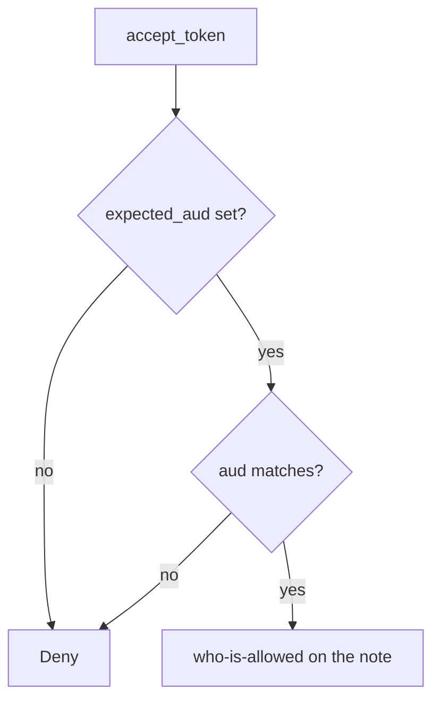

# Require the expected audience before who-is-allowed

**Kind:** design-exercise
**Loop step:** 4 Build

## The rule

`accept_token` must compare `aud` to `expected_aud`. Missing `aud` is deny. A list may contain the expected name; it must not succeed because `sub` exists. Structural means the audience is mediated — not “we use JWTs,” not Authlib defaults, not HTTPS, not “OpenID Connect is on.”

The smallest restore for notes-app token acceptance is: empty expected audience, missing claim, or mismatch is **deny**. Then who-is-allowed on the note. ID-token `aud` equals `client_id` is a different check.

## Picture: name match, then who-is-allowed



The lab’s repaired files compare `aud` (string or list membership) to `expected_aud`. PKCE, `state`, `nonce`, JWKS, `iss`, and DPoP are named leftovers — they are not proven by this practice. Browser-app and native-app RFCs name client-shape holes; this pytest is the resource-server `aud` check only.

Industry checklists want tokens intended for that service. This pytest is that sentence for `securecollab-api`.

## What the repaired files must show

| After the fix | Must be true |
|---|---|
| aud=securecollab-api | allow (then who-is-allowed) |
| aud=other-api | deny |
| missing aud | deny |

## What this is not

ID-token `aud` equals `client_id`. PKCE. DPoP (advanced sender-constraint). Object grants on the note. OAuth 2.1 as a final standard. Auth0 dashboard green.

## What can still go wrong

- Correct `aud` still needs who-is-allowed on the note.
- Empty `aud`; array tricks; `alg=none` — reject unknown algorithms; this page is not a payload catalogue.
- PKCE, `state`, `nonce`, `iss`, `exp`, JWKS, mix-up, and sender-constraining stay out of this practice.
- Leftover tokens after a client is removed.
- A browser app holding the access token is leftover (prefer a backend-for-frontend).

## Practice

Name expected audience and the check (`aud` matches, else deny). Run:

```text
python3 -m pytest labs/4.5/4.5-lab/tests --impl fixed
```

It must pass.

## Use it somewhere new

Clinic FHIR resource server with a hospital-specific `aud`. Native redirect (claimed HTTPS, not a custom scheme) is leftover, not this pytest.

## What this page is not doing

Do not connect a live identity provider. Do not present OAuth 2.1 as final.
